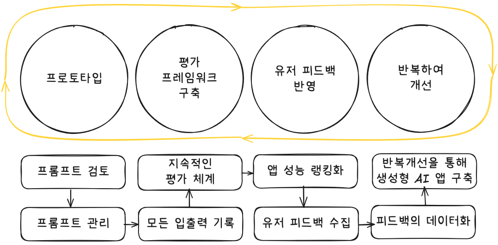
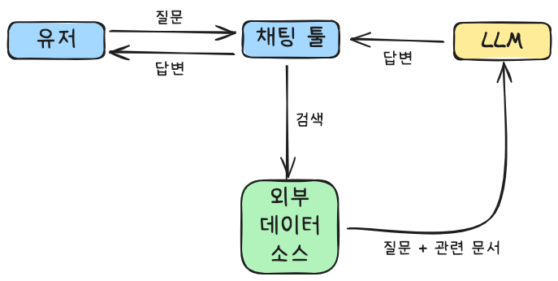
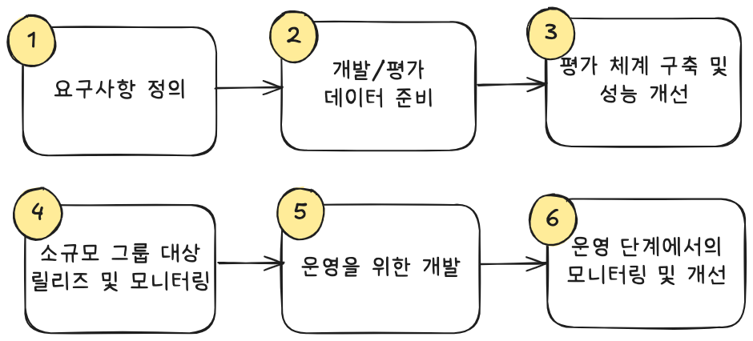

# 생성형 AI 시대, Observability와 RAG로 시스템을 최적화하는 방법

생성형 AI 기술이 발전하면서 AI 에이전트와 같은 다양한 애플리케이션이 등장하고 있습니다. 이러한 시스템의 **성능**과 **신뢰성**을 확보하는 것은 물론, 배포 이후에도 **지속적인 품질 개선**을 이루는 것이 무엇보다 중요합니다. 이 글에서는 이러한 목표를 달성하기 위한 핵심 방법론인 **Observability**와 **RAG(Retrieval-Augmented Generation)** 에 대해 자세히 알아보겠습니다.

---

## 생성형 AI 기반 시스템의 Observability

Observability는 시스템의 **내부 상태와 작동 과정을 가시화**하여 심층적으로 파악하고 문제를 해결하는 방법론입니다. 일반적인 클라우드 애플리케이션에서 CPU 사용률, 메모리 사용량, HTTP 요청 수 등을 모니터링하는 것과 유사하게, 생성형 AI 애플리케이션에서는 **"생성된 응답이 어떤 근거(Retrieved Evidence)로 어떤 흐름을 거쳐 작성되었는지"** 를 추적하는 것이 핵심입니다. 즉, 모델에 주어진 프롬프트와 컨텍스트에서 어떤 내부 과정을 거쳐 결과가 생성되었는지 깊이 있게 파악하는 것이죠.

### 개발 단계에서의 Observability

개발 단계에서 Observability는 생성형 AI 애플리케이션의 구성 요소를 **구조적으로 파악**하고, 각 요소가 어떻게 상호작용하는지 명확하게 관리하는 데 필수적입니다. 시스템 프롬프트, RAG 설정, 외부 API 연동 등 **세부 요소까지 체계적인 버전 관리**가 이루어져야 합니다.

또한, 시스템에 오고 가는 **입출력 데이터를 철저히 추적**하고, 각 입출력 간의 관계를 명확하게 파악할 수 있어야 합니다. 특히 멀티 에이전트 시스템의 경우, 에이전트 간의 상호작용 과정과 전체 플로우를 일관성 있게 기록하는 것이 높은 수준의 추적성과 디버깅 능력을 확보하는 데 필수적입니다.

### 배포 단계에서의 Observability

시스템이 배포된 이후에는 사용자 경험 및 문의를 통해 개발 단계에서 예상하지 못했던 다양한 상황에 직면할 수 있습니다. 장문의 질문이나 새로운 도메인에 대한 확장된 대화, 혹은 LLM의 학습 시점 이후에 등장한 정보(모델의 컷오프 날짜 문제) 등이 대표적인 예시입니다.

이러한 문제를 해결하기 위해서는 **일별로 사용자 질문 내용, 중간 상태, 모델 응답 과정을 연결하여 기록**하고, 오류 발생 시 신속하게 파악할 수 있는 체계가 필요합니다. 모델의 입력, 출력, 중간 추론 과정, 사용자 평가를 통합적으로 관리할 수 있어야 하며, 이러한 데이터를 바탕으로 **프롬프트 최적화, RAG 설정 수정, 모델 버전 조정 및 재배포**를 신속하게 진행할 수 있어야 합니다. 커서AI(Cursor AI)가 자연스럽게 'Accept'와 'Reject'를 선택하도록 유도하여 사용자 피드백을 반영하는 루프를 잘 구현한 것처럼, 사용자 피드백을 시스템 개선에 적극적으로 활용하는 것이 중요합니다.

### Observability 요약

개발 단계와 배포 단계를 아우르는 **종합적인 Observability 체계**는 신뢰할 수 있는 고품질 AI 서비스를 지속적으로 제공하는 데 필수적인 기반입니다.

---

## RAG(Retrieval-Augmented Generation)

LLM(Large Language Model)은 학습 시점 이후에 등장한 최신 정보나 기업 내부의 비공개 데이터 등에 대한 정확한 답변을 제공하기 어렵다는 한계가 있습니다. 이러한 문제를 해결하기 위해 등장한 기술이 바로 **RAG(Retrieval-Augmented Generation)** 입니다. RAG는 LLM이 **외부 데이터 소스를 참조**할 수 있도록 하여, 모델에 학습되지 않은 정보를 기반으로 답변을 생성하도록 돕는 기술입니다.

### RAG 시스템의 구성과 흐름

RAG 시스템은 다음과 같은 흐름으로 작동합니다.

1.  **사용자 질문 입력**: 사용자가 질문을 입력합니다.
2.  **정보 검색**: 검색 시스템이 외부 데이터 소스에서 질문과 관련된 정보를 검색합니다.
3.  **답변 생성**: 검색된 정보를 바탕으로 LLM이 최종 답변을 생성합니다.

이러한 과정을 통해 LLM은 적절한 데이터에 접근하게 되어 더욱 **신뢰성 있는 답변**을 제공할 수 있게 됩니다.

### RAG 사용 사례

RAG 시스템은 최신 정보 활용이나 내부 데이터 연동이 필요한 다양한 산업 분야에서 널리 사용되고 있습니다.

* **국내 금융사의 생성형 AI 솔루션**: 생성형 AI 기반 지능형 기업 문서 관리 서비스, 맞춤형 금융 상품 추천 등 다양한 AI 뱅킹 서비스 구축에 활용됩니다.
* **LG CNS 온보딩 챗봇**: 신입 사원 온보딩 과정에서 RAG 기반 AI 챗봇을 도입하여 사내 가이드, 규정, FAQ 등을 채팅 형태로 안내합니다.
* **콜센터 챗봇**: 콜센터 상담 업무에 생성형 AI 챗봇을 구축하고 RAG 기술을 적용하여 과거 상담 이력, 매뉴얼 등을 실시간으로 검색해 상담사에게 최적화된 답변을 제공합니다.
* **금융사 회신 문서 생성**: 배당 담당자가 민원 회신문을 작성할 때, 기존 답변서를 기반으로 초안을 자동 생성하여 리드타임 감소 및 작성 시간 단축 효과를 얻습니다.
* **E-mail 자동 회신**: 제목에 특정 키워드가 있는 메일을 읽고 RAG를 적용하여 자동으로 답변을 작성하는 등 다양한 자동화에 활용됩니다.

### RAG 시스템의 평가

RAG 시스템을 개발한 후 실제 서비스에 투입하려면 일정 수준의 품질을 충족하는지 **객관적으로 평가**하는 것이 필수적입니다. RAG 시스템의 평가는 구현에 비해 상당한 시간과 노력을 요하며, 이론적인 평가뿐만 아니라 **실제 서비스 상황에서도 적용 가능한 실용적인 평가 방법**을 고려해야 합니다.

RAG 시스템은 크게 **Retriever를 통한 검색**과 **Generator를 통한 답변 생성**의 두 단계로 구성됩니다. 시스템 전체에 대한 end-to-end 통합 평가뿐 아니라 각 컴포넌트 단위로 세분화된 평가도 병행해야 합니다. 사용자가 부정확한 답변을 받으면 Retriever가 적절한 검색을 못해서인지, Generator가 정보를 올바르게 활용하지 못한 것인지, 프롬프트의 설계가 잘못된 것인지 **원인 파악**이 필요하기 때문입니다.

RAG 시스템의 개발과 평가는 일반적으로 다음과 같은 절차를 따릅니다.

1.  요구사항 정의
    - 해결하고자 하는 과제를 명확히 정의
    - 시스템이 달성해야할 정확도, 비용, 레이턴시 등 주요 성능 목표 정의
2.  개발/평가 데이터 준비
    - 시스템에 입력할 질문과 기대되는 출력을 한 쌍으로 구성한 개발 및 평가용 데이터 준비
3.  평가 체계 구축 및 성능 개선
    - 평가 체계 구축, 초기 버전의 시스템을 반복적으로 개선
    - End-to-End 정확도 평가, 레이턴시 및 시스템 운영 비용 등 모니터링 등 진행
4.  소규모 그룹 대상 릴리즈 및 모니터링
    - 시스템이 일정 수준에 도달하면, 소규모 사용자 그룹 대상 으로 릴리즈
    - 이 과정에서 실제 사용 데이터 수집, 사용자 피드백 반영
5.  운영을 위한 개발
    - 기밀 데이터 유출, 프롬프트 인젝션 등의 보안 리스크 점검
    - 데이터 보호 및 시스템 신뢰성, 가용성 확보
6.  운영 단계에서의 모니터링 및 개선
    - 본격적인 운영 이후에도 지속적인 시스템 모니터링 및 개선 필요
    - 사용자 피드백과 요구사항을 수렴하며 장기적인 품질 향상 도모

---

## RAG 시스템의 성능 저하 원인과 개선 방법

RAG 시스템은 질문을 받는 순간부터 최종 응답을 생성하는 전 과정에서 다양한 최적화가 필요합니다.

### RAG 시스템 성능 저하의 원인

RAG 시스템을 실제 업무에 적용하는 과정에서 자주 발생하는 문제들은 다음과 같습니다.

* **모호한 쿼리**: 질문 자체가 모호하거나 구체적이지 않아 의도와 다른 검색 결과가 나올 수 있습니다.
* **인덱스 최적화 부족**: 데이터 청크 분할, 임베딩 벡터 품질 미흡 등이 검색 성능 저하로 이어질 수 있습니다.
* **리랭킹의 미비**: 검색 결과를 관련도 순으로 재정렬하는 과정이 미흡하여 필요한 정보가 상위에 노출되지 못할 수 있습니다.
* **응답의 일관성 부족**: LLM의 태생적인 한계로 인해 응답의 일관성이 떨어질 수 있습니다.

### RAG 시스템의 개선 방법

> Image from [rag-from-scratch](https://github.com/langchain-ai/rag-from-scratch?tab=readme-ov-file) 

위 그림은 RAG 시스템의 처리 플로우를 도식화한 것입니다.

RAG 시스템의 개선은 질문을 받는 단계부터 답변을 생성하는 단계까지 전 과정에서 이루어질 수 있습니다. 주요 단계는 크게 다음 여섯 가지로 나눌 수 있으며, 각 단계의 세부 사항 및 개선 기법은 다음과 같습니다.

1.  **쿼리 확장 (Query Enhancement)**
    * **대응 목적**: 검색 품질 향상
    * **원인**: 모호한 쿼리
    * **설명**: 사용자가 입력한 쿼리를 최적 형태로 변환하여 모호한 쿼리를 구체화하고 높은 관련성을 가진 정보를 얻을 확률을 높입니다.
    * **기법**:
        * **Multi-query**: 쿼리를 여러 관점에서 분할, 병렬 처리하여 검색 정확도를 높입니다.
        * **RAG-Fusion**: 검색 결과를 통합하여 보다 정확한 답변을 도출합니다.
        * **Decomposition**: 복잡한 쿼리를 간단한 서브 쿼리로 분해합니다.
        * **Step-back**: 한 번 검색 결과를 리뷰 후 쿼리를 다시 수행합니다.
        * **HyDE**: 가설을 생성하고 이를 토대로 추가 정보를 검색합니다.

2.  **라우팅 (Routing)**
    * **대응 목적**: 검색 품질 향상, 시스템 성능 개선
    * **원인**: 모호한 쿼리, 인덱스 최적화 부족
    * **설명**: 쿼리를 적절한 데이터 소스나 검색 엔진으로 분배하는 과정으로, 검색 정확도를 높이고 효율적이고 확장성 있는 검색을 구현합니다.
    * **기법**:
        * **Logical routing**: 명확한 규칙에 따라 데이터 소스를 선택합니다.
        * **Semantic routing**: 쿼리의 의미 분석을 통해 검색 대상을 결정합니다.

3.  **쿼리 구성 (Query Construction)**
    * **대응 목적**: 검색 품질 향상
    * **원인**: 모호한 쿼리
    * **설명**: 검색 대상 데이터베이스에 맞춰 최적의 쿼리를 생성하는 과정입니다. VectorDB, RDB, GraphDB 등 다양한 데이터베이스 형식에 따라 임베딩 생성이나 구조화 쿼리 변환을 수행합니다.
    * **기법**:
        * **VectorDB (Self-query retriever)**: 쿼리 자체를 최적화하여 임베딩 공간에서 고정밀 검색을 실현합니다.
        * **RDB (Text-to-SQL)**: 자연어 쿼리를 SQL 형식으로 변환하여 데이터베이스를 효율적으로 검색합니다.
        * **GraphDB (Text-to-Cypher)**: 자연어 쿼리를 Cypher 쿼리로 변환하여 그래프 데이터베이스의 관계성을 활용한 검색을 실현합니다.

4.  **인덱스 최적화 (Indexing)**
    * **대응 목적**: 검색 품질 향상, 시스템 성능 개선
    * **원인**: 인덱스 최적화 부족
    * **설명**: 검색 성능과 확장성을 높이기 위해 데이터 구조와 전략을 최적화하는 과정입니다. 데이터 분할, 표현 형식 최적화 등을 통해 검색 정확도를 향상시킵니다.
    * **기법**:
        * **Chunk Optimization**: 데이터를 의미에 맞게 적절한 단위로 분할하여 검색의 정확도와 효율성을 높입니다.
        * **Multi-representation indexing**: 상위 문서나 다양한 벡터 표현을 병행하여 다각적인 검색을 구현합니다.
        * **Specialized Embeddings**: 임베딩 모델을 미세 조정하거나 특정 태스크에 맞게 최적화하여 보다 정확한 검색을 가능하게 합니다.
        * **Hierarchical Indexing**: 데이터의 계층적 인덱스 설계를 통해 효율적인 검색과 리소스 사용을 최적화합니다.

5.  **검색 (Retrieval)**
    * **대응 목적**: 검색 품질 향상
    * **원인**: 모호한 쿼리, 리랭킹의 미비
    * **설명**: 사용자 쿼리에 대해 가장 관련성 높은 정보를 찾아내고 결과를 정제합니다. 랭킹 기법 및 리파인먼트(Refinement) 기법을 함께 활용합니다.
    * **기법**:
        * **Ranking**: 검색 결과의 순위를 재평가하여 최적의 정보를 상위에 노출합니다 (예: Re-Rank, RankLLM).
        * **Refinement**: 검색 결과를 세분화하여 정보의 일관성과 품질을 높입니다 (예: CRAG).
        * **Active Retrieval**: 사용자 쿼리나 문맥에 따라 동적으로 검색을 최적화합니다.

6.  **생성 (Generation)**
    * **대응 목적**: 응답 품질 강화
    * **원인**: 응답의 일관성
    * **설명**: RAG 시스템의 최종 단계로, 검색된 정보를 기반으로 사용자에게 최적의 답변을 제공합니다. 자기 개선형 생성 기법을 도입하면 응답의 일관성과 정확성을 더 높일 수 있습니다.
    * **기법**:
        * **Active Retrieval (Self-RAG)**: 검색과 생성 프로세스를 통합하여 동적이고 적응적인 응답 생성을 가능하게 합니다. 쿼리에 따라 문서 검색의 필요성을 판단하고 생성 품질을 점검하여 할루시네이션 억제와 답변 품질 향상에 효과적입니다.

---

RAG 시스템 개발 및 성능 개선을 보다 효율적으로 진행하기 위해 위에 제시된 내용들이 도움이 되기를 바랍니다.

이 글은 Weights & Biases에서 공개한 '생성형 AI 애플리케이션의 평가와 관측성' 백서를 참고하여 작성되었습니다.