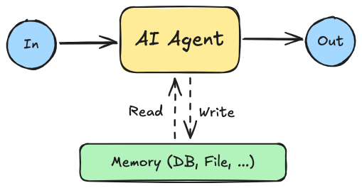

오늘은 Weights & Biases(W&B)에서 공개한 '생성형 AI 애플리케이션의 평가와 관측성' 백서를 보며 AI 분야에서 가장 뜨거운 주제 중 하나인 **AI 에이전트**에 대해 깊이 파고들어 봤다. 단순히 질문에 답하는 것을 넘어, 스스로 추론하고 계획하며 외부 도구를 활용해 복잡한 작업을 수행하는 에이전트의 능력은 정말 무궁무진한 가능성을 가지고 있는 것 같다. 그런데 '에이전트'라는 단어 하나로 모든 것을 설명하기엔 그 안에 숨겨진 다양한 디자인 패턴들이 있다는 걸 알게 되었다. 마치 건물을 지을 때 다양한 설계 방식이 있듯이, AI 에이전트도 여러 패턴을 조합해서 만들 수 있다는 게 흥미로웠다.

오늘은 AI 에이전트의 핵심 디자인 패턴들을 체계적으로 정리하고, 이러한 패턴들이 실제 시스템 설계에서 어떻게 조합되어 강력한 시너지를 내는지 이해하는 데 집중했다.

---

## AI 에이전트의 핵심 디자인 패턴

AI 에이전트(이하 에이전트)는 다양한 문제를 해결하고 여러 기능을 수행하는데, 이를 구현하기 위한 몇 가지 주요 설계 방식, 즉 **패턴**들이 존재한다. 오늘은 대표적인 6가지 에이전트 패턴을 정리했다.

### 1. Chain of Thought (CoT)

에이전트가 복잡한 문제를 만났을 때, 단번에 정답을 내놓기보다는 **단계별로 차근차근 추론하며 해결**하도록 돕는 기법이다. 마치 수학 문제를 풀 때 '문제 이해 → 개념 적용 → 계산 수행 → 최종 해석'과 같이 체계적인 과정을 거치는 것과 같다. 복잡한 문제를 작은 단위로 쪼개고 각 단계마다 생각을 펼쳐나감으로써, 최종 답변의 정확성과 신뢰도를 크게 높일 수 있다. 법률 분석에서 관련 판례나 조문을 체계적으로 검토하고 주요 논거를 정리하는 과정도 이 CoT 패턴의 좋은 예시가 될 수 있겠다.

### 2. Reflection

이 패턴은 에이전트가 **자신이 만들어낸 결과물을 스스로 검토**하고, 여기서 오류나 개선할 점을 찾아내어 반복적으로 수정하는 과정을 의미한다. 마치 사람이 자신의 실수를 되짚어보고 더 나은 방법을 찾아내는 것처럼, 에이전트도 이런 자기 평가를 통해 응답의 품질과 정밀도를 향상시키는 것이다.

**Self-Reflective RAG 프레임워크**가 바로 이 Reflection 패턴을 잘 구현한 예시다. 이 프레임워크는 필요할 때마다 동적으로 정보를 검색하고, 각 단계에서 생성된 결과물을 평가하고 수정함으로써 정보의 정밀도와 관련성을 계속해서 최적화한다. 기존의 RAG 방식이 일괄적으로 문서를 모으는 것과 달리, 훨씬 유연하고 지능적으로 정보를 활용할 수 있다는 점이 큰 장점이다.

### 3. Planning

**Planning**은 에이전트가 복잡한 작업을 수행할 때, 그 작업을 더 작은 단위로 쪼개고 **어떤 순서로 실행할지 최적의 전략을 수립하는 과정**을 말한다. 단순히 질문에 대한 응답을 생성하는 수준을 넘어, 현재 상황을 정확하게 분석하고 목표 달성을 위한 가장 효율적인 경로를 설계하는 데 초점을 맞춘다. 명확한 행동 계획을 세우고 이를 순차적으로 실행하는 것이 Planning 패턴의 핵심이다.

### 4. Memory-Augmented Agents

장기적인 대화나 여러 단계를 거치는 복잡한 작업을 수행할 때, 에이전트가 **과거의 대화 문맥이나 작업 이력을 잊지 않고 기억**하여 일관성 있는 상호작용을 할 수 있도록 돕는 구조이다. 예를 들어, 고객 지원 에이전트가 사용자의 과거 문의 이력이나 선호 데이터를 기억하고 있다면 훨씬 개인화된 답변을 제공할 수 있을 것이다.

이 '기억'은 단순한 텍스트 로그 형태로 저장될 수도 있고, 외부 데이터베이스와 연동되거나, 대화의 중요한 내용만 요약해서 저장하는(Summarization Memory) 등 다양한 형태로 구현될 수 있다.

### 5. Tool Use

개인적으로 이 **Tool Use** 패턴이 단순 LLM과 AI 에이전트를 구분하는 가장 중요한 요소라고 생각한다. 이 패턴은 에이전트가 **외부의 다양한 툴이나 API와 직접 상호작용**하여 필요한 정보를 찾아오거나, 외부 시스템에 특정 동작(액션)을 수행하는 기능을 의미한다.

예를 들어, 여행 일정을 추천하는 시스템이라면 항공권 가격 조회 API, 호텔 정보 API 등을 실시간으로 활용하여 최적의 옵션을 제안할 수 있다. 나아가 단순히 정보만 제공하는 것을 넘어, 직접 항공권을 예약하거나 티켓을 발행하는 등의 실제 업무 오퍼레이션까지 수행할 수 있게 된다. Tool Use 패턴을 통해 에이전트는 단순 텍스트 응답을 넘어 현실 세계에 직접적인 영향을 미치는 능력을 갖출 수 있다.

### 6. Multi-Agent Collaboration

복잡하고 규모가 큰 작업을 효율적으로 처리하기 위해 **여러 개의 특화된 에이전트들이 서로 협력**하는 방식이다. 이는 주로 두 가지 구조로 나눌 수 있다.

* **순차형 구조**: 각 에이전트가 정해진 순서대로 작업을 수행하고, 그 결과를 다음 에이전트에게 전달하는 방식이다. 비교적 단순하거나 미리 정해진 흐름이 있는 작업에 적합하며, 각 단계의 책임이 명확하다는 장점이 있다.
* **계층형 구조**: '슈퍼바이저' 역할을 하는 에이전트가 전체적인 작업 계획을 세우고, 그 아래의 하위 에이전트들에게 개별적인 작업을 할당하는 방식이다. 여러 에이전트가 동시에 작업을 진행하면서도 전체 목표와의 일관성을 유지할 수 있어, 규모가 크거나 복합적인 시스템에서도 뛰어난 확장성과 조정 능력을 보여준다. (더 다양한 패턴은 [Google ADK Docs - Multi-agent system](https://google.github.io/adk-docs/agents/multi-agents/)에서 찾아볼 수 있다.)

---

## 패턴의 조합

에이전트를 설계할 때 각 패턴을 독립적으로 사용하는 것도 좋지만, **여러 패턴을 함께 조합하면 훨씬 더 강력하고 효과적인 솔루션**을 만들 수 있다. 마치 요리할 때 여러 재료를 섞어 더 맛있는 음식을 만드는 것과 비슷하다. 몇 가지 흥미로운 조합 사례들을 살펴보았다.

### 1. Reflection + Chain of Thought

복잡한 수리 문제나 논리적인 추론이 필요한 문제를 해결할 때는 **Chain of Thought**로 단계별 추론을 시키고, 여기에 **Reflection**을 더해 에이전트가 스스로 자신의 추론 과정을 검증하고 보완하도록 하는 것이 효과적이다.

* **어떤 시너지가 날까?** 문제를 단계적으로 분해하여 해결하면서, 동시에 그 결과가 정확한지 스스로 확인하고 오류가 있다면 해결 과정을 다시 수행하여 정밀도를 크게 향상시킬 수 있다.
* **어떤 사례에 적용할 수 있을까?** 교육용 AI 튜터를 예로 들 수 있다. 에이전트가 학생의 해답을 분석하며 **Chain of Thought** 방식으로 "왜 이 답이 틀렸는지"를 논리적으로 짚어낸다. 그리고 나서 **Reflection**을 통해 자신이 제시한 설명이나 해답이 정확한지 다시 한번 검토하고, 오류가 있다면 문제 해결 과정을 다시 수행하여 완벽한 답변을 제공한다.

### 2. Tool Use + Memory-Augmented Agents

과거 대화 이력이나 사용자 정보를 기억해야 하고, 동시에 외부 데이터를 실시간으로 처리해야 하는 작업에는 **Memory-Augmented Agents**와 **Tool Use**의 조합이 빛을 발한다.

* **어떤 시너지가 날까?** 에이전트가 사용자의 과거 이력이나 업무 컨텍스트를 장기적으로 기억하면서, 외부 API나 시스템과 협력하여 필요한 동적 데이터를 검색하고 처리하여 개인화된 서비스를 제공할 수 있다.
* **어떤 사례에 적용할 수 있을까?** '퍼스널 어시스턴트형 AI'가 대표적이다. 에이전트가 **Memory-Augmented** 기능을 통해 사용자의 여행 이력이나 선호도를 기억하고 있다가, 다음 여행을 제안할 때 이를 활용한다. 여기에 **Tool Use**를 더해 항공권 API, 호텔 예약 사이트, 날씨 정보 등을 실시간으로 조회하여 사용자의 취향에 꼭 맞는 여정을 계획하고 심지어 예약까지 진행할 수 있다.

### 3. Planning + Multi-Agent Collaboration

규모가 크거나 매우 복잡한 작업을 수행해야 할 때는 **Planning**으로 전체적인 계획을 세우고, **Multi-Agent Collaboration**을 통해 여러 에이전트가 역할을 분담하여 병렬적으로 작업을 진행하는 조합이 매우 효과적이다.

* **어떤 시너지가 날까?** 큰 목표 달성을 위한 체계적인 계획을 수립하고, 이 계획에 따라 여러 특화된 에이전트들이 각자의 역할을 맡아 동시에 작업을 수행함으로써 효율성과 정확도를 높일 수 있다.
* **어떤 사례에 적용할 수 있을까?** 최신 연구 논문 작성 지원 에이전트를 상상해볼 수 있다. 슈퍼바이저 에이전트가 논문 탐색, 관련 기술 및 사례 분석, 논문 작성 등 전체 작업을 **Planning**하고 분할한다. 그리고 각 작업에 대해 전담하는 하위 에이전트들이 **Multi-Agent Collaboration**을 통해 논문 탐색 에이전트, 기술 분석 에이전트, 본문 작성 에이전트 등으로 나뉘어 각자의 역할을 수행하는 것이다.

---

## 에이전트 개발 고려사항

AI 에이전트를 활용한 시스템 개발은 이처럼 다양한 패턴들을 통합하면서 점점 더 복잡한 형태로 진화하고 있는 것 같다. 다행히 에이전트 개발을 위한 다양한 도구와 프레임워크들이 계속해서 나오고 있어서 개발 자체는 점점 편리해지고 있다고 한다.

하지만 여기서 가장 중요한 숙제는 바로 **아키텍처 설계**라고 한다. 여러 패턴들이 서로 효율적으로 맞물려 돌아가려면, 패턴 간의 상호작용과 에이전트들 간의 연계를 정말 세밀하게 조정해야 하기 때문이다. 특히 **Tool Use**와 **Multi-Agent Collaboration**을 얼마나 효과적으로 통합하느냐가 경쟁력 있는 시스템을 만드는 핵심이라고 하니, 이 부분에 대한 고민이 많이 필요할 것 같다.

그리고 아무리 똑똑하고 복잡한 에이전트를 만들어도, 이 에이전트가 제대로 작동하는지 확인하고 시스템을 계속해서 개선해 나가기 위해서는 **전체 시스템이나 중간 프로세스의 입출력을 꼼꼼히 기록하고 평가하는 것**이 무엇보다 중요하다는 것을 다시 한번 깨달았다. 개발 단계에서의 오프라인 평가뿐만 아니라, 실제 운영 단계에서의 온라인 평가도 가능하게 해야 한다. 추후 에이전트 평가 방법에 대해서도 공부해서 정리해보겠다.