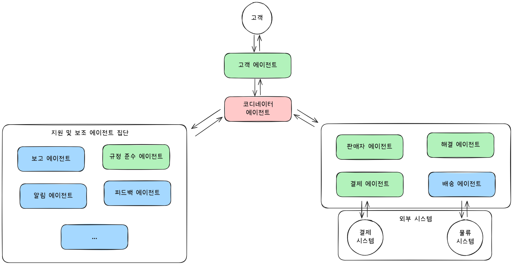

오늘은 마이크로소프트에서 공개한 [AI Agents for Beginners](https://github.com/microsoft/ai-agents-for-beginners) 중 **Multi-agent design patterns** 파트를 공부하고 내용을 정리했습니다. 최근 진행 중인 프로젝트에서 멀티 에이전트(Multi-Agent) 협업 시스템을 구축하면서 많은 고민이 있었는데, 오늘 학습을 통해 좀 더 명확한 방향성을 얻게 된 것 같습니다.

---

## Multi-agent 디자인 패턴

다중 에이전트 시스템을 설계할 때 고려해야 할 핵심 패턴과 그 적용 시나리오, 장점, 그리고 구현을 위한 빌딩 블록 및 가시성 확보 방안에 대해 학습했습니다. 특히 단일 에이전트로는 처리하기 어려운 복잡하고 대규모의 작업에 다중 에이전트가 어떻게 효과적으로 적용될 수 있는지 이해하는 데 중점을 두었습니다.

---

### 다중 에이전트 시스템의 필요성 및 장점

다중 에이전트 시스템은 단순히 여러 에이전트가 모여 있는 것을 넘어, 각 에이전트가 특정 역할을 수행하며 상호작용하여 공통의 목표를 달성하는 설계 패턴입니다. 이러한 패턴은 로봇 공학, 자율 시스템, 분산 컴퓨팅 등 다양한 분야에서 폭넓게 활용됩니다.

**다중 에이전트 적용 시나리오:**

* **대규모 작업(Large workloads):** 대규모 작업을 작은 단위로 나누어 여러 에이전트에 할당함으로써 병렬 처리 및 빠른 완료가 가능합니다. 예를 들어, 대규모 데이터 처리 작업에 유용합니다.
* **복잡한 작업(Complex tasks):** 복잡한 작업을 세분화된 하위 작업으로 분해하고, 각 하위 작업을 특정 분야에 특화된 에이전트에 할당하여 효율적으로 처리할 수 있습니다. 자율 주행 차량의 경우 내비게이션, 장애물 감지, 차량 간 통신 등을 각기 다른 에이전트가 담당하는 것이 좋은 예시입니다.
* **다양한 전문성(Diverse expertise):** 각 에이전트가 고유한 전문성을 가질 수 있어 단일 에이전트보다 훨씬 효과적으로 다양한 측면의 작업을 처리할 수 있습니다. 헬스케어 분야에서 진단, 치료 계획, 환자 모니터링을 담당하는 에이전트들이 협력하는 것을 예로 들 수 있습니다.

**단일 에이전트 대비 다중 에이전트의 장점:**

* **전문화(Specialization):** 각 에이전트를 특정 작업에 특화시킬 수 있어 복잡한 상황에서 단일 에이전트가 겪을 수 있는 혼란을 줄이고 효율성을 높입니다.
* **확장성(Scalability):** 시스템 확장 시 단일 에이전트에게 과부하를 주는 대신, 필요에 따라 에이전트를 추가하여 쉽게 확장할 수 있습니다.
* **결함 허용(Fault Tolerance):** 하나의 에이전트에 문제가 발생하더라도 다른 에이전트들이 계속해서 기능을 수행할 수 있어 시스템의 신뢰성을 보장합니다.

예를 들어, 사용자 여행 예약 시스템에서 단일 에이전트는 비행기, 호텔, 렌터카 예약을 모두 처리해야 하므로 복잡하고 유지보수 및 확장이 어려울 수 있습니다. 반면 다중 에이전트 시스템에서는 각 에이전트가 특정 예약(비행기, 호텔, 렌터카)을 전담하여 시스템이 더 모듈화되고 유지보수 및 확장이 용이해집니다.

---

### 다중 에이전트 디자인 패턴 구현을 위한 빌딩 블록

다중 에이전트 디자인 패턴을 구현하기 위해서는 다음의 빌딩 블록들을 이해하는 것이 필수적입니다.

* **에이전트 통신(Agent Communication):** 에이전트들이 사용자 선호도나 제약 조건과 같은 정보를 서로 공유하고 통신할 수 있는 프로토콜과 방법을 결정해야 합니다. 예를 들어, 비행기 예약 에이전트와 호텔 예약 에이전트가 여행 날짜 정보를 공유해야 합니다.
* **조정 메커니즘(Coordination Mechanisms):** 에이전트들이 사용자의 선호도와 제약 조건을 충족시키기 위해 각자의 행동을 조율하는 방법을 결정해야 합니다. 예를 들어, 호텔 예약 에이전트가 공항 근처 호텔을 예약할 때 렌터카 에이전트와 협력하여 렌터카가 공항에서만 가능한지 확인하는 것입니다.
* **에이전트 아키텍처(Agent Architecture):** 각 에이전트가 사용자 상호작용을 통해 의사결정을 내리고 학습할 수 있는 내부 구조를 갖춰야 합니다. 비행기 예약 에이전트가 사용자 과거 선호도를 기반으로 머신러닝 모델을 사용하여 비행기를 추천하는 방식 등을 포함합니다.
* **다중 에이전트 상호작용 가시성(Visibility into Multi-Agent Interactions):** 다중 에이전트 간의 상호작용을 추적하고 모니터링할 수 있는 도구와 기술이 필요합니다. 이는 디버깅, 최적화 및 시스템의 전반적인 효율성 보장에 필수적입니다. 앞선 포스트에서 다루었던 Observability와 같은 내용입니다.
* **다중 에이전트 패턴(Multi-Agent Patterns):** 중앙 집중식, 분산형, 하이브리드 아키텍처 등 다양한 다중 에이전트 시스템 구현 패턴 중에서 사용 사례에 가장 적합한 패턴을 선택해야 합니다.
* **휴먼 인 더 루프(Human in the loop):** 대부분의 경우 사용자 개입이 필요하며, 에이전트가 언제 사용자에게 개입을 요청해야 하는지 지시해야 합니다. 이는 특정 호텔이나 비행기를 요청하거나, 예약 전 확인을 요청하는 등의 형태로 나타날 수 있습니다.

---

### 다중 에이전트 상호작용 가시성 확보

시스템의 디버깅, 최적화, 그리고 전반적인 효율성 보장을 위해 다중 에이전트 간 상호작용에 대한 가시성을 확보하는 것이 중요합니다. 이를 위한 주요 방법들은 다음과 같습니다.

* **로깅 및 모니터링 도구:** 각 에이전트가 취하는 모든 행동에 대해 로깅을 수행해야 합니다. 로그 엔트리에는 액션을 취한 에이전트, 취해진 액션, 액션이 취해진 시간, 그리고 액션의 결과에 대한 정보가 포함되어야 합니다. 이 정보는 디버깅 및 최적화에 활용될 수 있습니다.
* **시각화 도구:** 시각화 도구는 에이전트 간의 상호작용을 더 직관적으로 보여줍니다. 예를 들어, 에이전트 간 정보 흐름을 보여주는 그래프를 통해 시스템의 병목 현상이나 비효율성 등을 식별할 수 있습니다.
* **성능 지표:** 성능 지표는 다중 에이전트 시스템의 효율성을 추적하는 데 도움이 됩니다. 작업 완료 시간, 단위 시간당 완료된 작업 수, 에이전트 추천의 정확도 등을 추적하여 개선이 필요한 영역을 파악하고 시스템을 최적화할 수 있습니다.

예를 들어, 여행 예약 시스템에서는 각 에이전트의 상태, 사용자 선호도 및 제약 조건, 에이전트 간 상호작용을 보여주는 대시보드를 통해 시스템 운영 상황을 한눈에 파악할 수 있습니다.

---

### 다중 에이전트의 구체적인 패턴

다중 에이전트 애플리케이션을 구축하는 데 유용한 몇 가지 구체적인 패턴을 살펴보았습니다.

* **그룹 채팅(Group chat):** 여러 에이전트가 서로 통신하는 그룹 채팅 애플리케이션을 만들 때 유용합니다. 팀 협업, 고객 지원, 소셜 네트워킹 등에 활용될 수 있습니다. 각 에이전트가 사용자 역할을 하고 메시징 프로토콜을 통해 메시지를 교환하며, 중앙 집중식 또는 분산형 아키텍처로 구현될 수 있습니다.

* **핸드오프(Hand-off):** 여러 에이전트가 서로 작업을 인계하는 애플리케이션에 유용합니다. 고객 지원, 작업 관리, 워크플로우 자동화 등에 활용되며, 각 에이전트가 작업 또는 워크플로우의 단계를 나타내고 정의된 규칙에 따라 작업을 인계합니다.

* **협업 필터링(Collaborative filtering):** 여러 에이전트가 협력하여 사용자에게 추천을 제공하는 애플리케이션에 유용합니다. 각 에이전트가 다른 전문성을 가지고 추천 프로세스에 기여할 수 있기 때문입니다. 예를 들어, 주식 추천 시스템에서 산업 전문가, 기술 분석가, 기본 분석가 에이전트들이 협력하여 종합적인 추천을 제공할 수 있습니다.

---

### 환불 프로세스 시나리오를 통한 에이전트 구성 이해

환불 프로세스 시나리오를 통해 다중 에이전트 시스템에서 에이전트를 어떻게 구성할 수 있는지 구체적으로 살펴보았습니다.

**환불 프로세스 전용 에이전트:**

* **고객 에이전트:** 환불 프로세스 시작.
* **판매자 에이전트:** 환불 처리.
* **결제 에이전트:** 고객 결제 환불.
* **해결 에이전트:** 환불 과정 중 발생하는 문제 해결.
* **규정 준수 에이전트:** 환불 프로세스의 규정 및 정책 준수 확인.

**범용 에이전트:**

* **배송 에이전트:** 제품 회수 배송 처리 (환불 외 일반 배송에도 사용 가능).
* **피드백 에이전트:** 고객 피드백 수집.
* **에스컬레이션 에이전트:** 문제 발생 시 상위 지원 단계로 에스컬레이션.
* **알림 에이전트:** 환불 프로세스 단계별 고객 알림 전송.
* **분석 에이전트:** 환불 관련 데이터 분석.
* **감사 에이전트:** 환불 프로세스 감사.
* **보고 에이전트:** 환불 프로세스 보고서 생성.
* **지식 에이전트:** 환불 및 기타 비즈니스 관련 지식 기반 유지.
* **보안 에이전트:** 환불 프로세스 보안 유지.
* **품질 에이전트:** 환불 프로세스 품질 보장.

이처럼 특정 프로세스에 특화된 에이전트와 여러 프로세스에서 재사용 가능한 범용 에이전트를 구분하여 설계함으로써, 효율적이고 확장 가능한 다중 에이전트 시스템을 구축할 수 있다는 점을 깨달았습니다. 그러나 이 에이전트들을 어떤 디자인 패턴으로 엮어서 시스템을 구성하면 좋을지에 대한 설명은 따로 명시되어있지 않아 아쉬웠습니다. 실제 환불 프로세스에서 이 에이전트들을 어떻게 연결하고 상호작용하게 할 것인지 고민해보았습니다.

### 환불 프로세스 시나리오를 위한 시스템 아키텍처

환불 프로세스는 고객 요청부터 실제 결제 환불, 그리고 발생 가능한 문제 해결에 이르기까지 여러 단계와 주체가 복합적으로 얽혀 있는 복잡한 작업입니다. 따라서 앞서 학습한 **다양한 전문성** 과 **복잡한 작업** 처리의 장점을 최대한 살리는 방향으로 아키텍처를 구상했습니다.

제안하는 시스템 아키텍처는 **핸드오프(Hand-off)** 패턴을 기반으로 하되, 특정 단계에서 **그룹 채팅(Group chat)** 및 **협업 필터링(Collaborative filtering)** 패턴의 요소를 가미하는 **하이브리드 형태**입니다. 주요 에이전트 간의 흐름은 핸드오프를 통해 순차적으로 진행되지만, 특정 이슈 해결이나 정보 공유 시에는 그룹 채팅 및 협업 필터링 방식을 활용하여 유연성과 효율성을 높이는 전략입니다.

---

#### 1. 코디네이터 에이전트 중심의 핸드오프(Hand-off) 기반 워크플로우

환불 프로세스의 핵심 흐름은 **코디네이터 에이전트**의 지휘 아래 각 단계별 전담 에이전트 간의 **핸드오프**를 통해 이루어집니다. 이 방식은 각 에이전트의 **전문화(Specialization)** 를 극대화하고, 명확한 책임 분담을 가능하게 하며, 복잡한 워크플로우를 중앙에서 효율적으로 관리할 수 있게 합니다.

> 간략하게 시스템 구성도를 그려보았습니다. 위에서 명시한 에이전트를 모두 넣자니 구성도가 너무 지저분해 보여서 보기 좋게 일부만 남겨보았습니다.

* **고객 에이전트 --> 코디네이터 에이전트:**
    * **고객 에이전트**는 고객으로부터 환불 요청을 직접 접수하고 기본적인 정보를 확인합니다. 이 요청 데이터를 **코디네이터 에이전트**에게 전달하여 환불 프로세스를 개시하도록 지시합니다. 코디네이터 에이전트는 이 요청을 바탕으로 전체 환불 절차를 시작합니다.
* **코디네이터 에이전트 --> 판매자 에이전트:**
    * **코디네이터 에이전트**는 고객 에이전트로부터 전달받은 환불 요청을 분석하여, 다음 단계의 책임 에이전트인 **판매자 에이전트**에게 환불 처리 관련 정보를 핸드오프합니다. 판매자 에이전트는 제품 반품 여부, 판매 기록 등을 확인하여 환불 승인/거부 결정을 내리고 그 결과를 다시 코디네이터 에이전트에게 보고합니다.
* **코디네이터 에이전트 --> 결제 에이전트:**
    * **코디네이터 에이전트**는 판매자 에이전트로부터 환불 승인 보고를 받으면, 실제 결제 환불을 위해 **결제 에이전트**에게 환불 실행 데이터를 핸드오프합니다. 결제 에이전트는 외부 결제 시스템과 연동하여 환불을 처리하고, 완료 여부를 코디네이터 에이전트에게 통보합니다.
* **코디네이터 에이전트 --> 배송 에이전트 (선택적):**
    * 물리적 제품의 환불인 경우, **코디네이터 에이전트**는 판매자 에이전트의 확인을 바탕으로 **배송 에이전트**에게 반품 배송 처리를 요청하고 고객에게 반품 주소와 절차를 안내하도록 지시합니다. 배송 상태는 코디네이터 에이전트에게 주기적으로 보고됩니다.
* **코디네이터 에이전트 --> 알림 에이전트 --> 고객 에이전트 (환불 완료 알림):**
    * **코디네이터 에이전트**는 결제 에이전트로부터 환불 완료 보고를 받으면, **알림 에이전트**에게 고객에게 최종 환불 완료 알림을 전송하도록 지시합니다. **알림 에이전트**는 이 정보를 **고객 에이전트**에게 전달하거나 직접 고객에게 알림을 보냅니다. 코디네이터 에이전트가 모든 알림의 시점을 제어하여 일관된 고객 경험을 제공합니다.

---

#### 2. 코디네이터 에이전트 주도의 그룹 채팅 및 협업 필터링

환불 과정에서 예외 상황이나 복잡한 문제가 발생할 경우, **코디네이터 에이전트**는 이를 인지하고 **해결 에이전트**를 활성화시켜 문제 해결을 위한 **그룹 채팅**과 **협업 필터링** 패턴을 주도하도록 지시합니다. 이는 단순히 작업을 인계하는 핸드오프 방식만으로는 대응하기 어려운 복잡성을 처리하는 데 필수적입니다.

* **코디네이터 에이전트 --> 해결 에이전트 주도의 그룹 채팅:**
    * **판매자 에이전트** 등 다른 핵심 에이전트로부터 환불 승인에 어려움을 겪거나 고객과의 분쟁이 발생했다는 보고를 **코디네이터 에이전트**가 받으면, **코디네이터 에이전트**는 즉시 **해결 에이전트**에게 개입을 지시합니다.
    * **해결 에이전트**는 코디네이터 에이전트의 지시에 따라 **고객 에이전트**, **판매자 에이전트**, 그리고 필요한 경우 **규정 준수 에이전트** 등을 하나의 임시 **그룹 채팅** 세션으로 초대합니다. 이 세션은 코디네이터 에이전트의 감독 하에 진행되며, 각 에이전트가 자신의 정보를 공유하고, 문제 해결을 위한 다자간 대화 및 협상을 진행합니다. 이는 복잡한 상황에서 정보의 투명성을 높이고 공동의 의사결정을 내리는 데 효과적입니다.
* **코디네이터 에이전트 --> 해결 에이전트 --> 지식/분석 에이전트와의 협업 필터링:**
    * 만약 환불 요청이 매우 복잡하거나 이례적인 경우, **코디네이터 에이전트**는 **해결 에이전트**에게 **지식 에이전트**와 **분석 에이전트**의 도움을 받도록 지시합니다.
    * **해결 에이전트**는 **지식 에이전트**에게 유사 사례나 정책 정보를 요청하고, **분석 에이전트**에게 과거 데이터 기반의 분석 결과(예: 특정 유형의 환불 요청에 대한 성공률, 평균 처리 시간 등)를 요청합니다.
    * 이러한 정보는 마치 **협업 필터링**처럼 다양한 전문성을 가진 에이전트들이 정보를 제공하고, 이를 종합하여 **해결 에이전트**가 최적의 해결책을 도출하는 데 기여합니다. 예를 들어, **지식 에이전트**는 관련 법규나 회사 정책을, **분석 에이전트**는 과거 통계 데이터를 제공하여 **해결 에이전트**가 종합적인 판단을 내리도록 돕는 것입니다. 이 모든 과정은 코디네이터 에이전트에게 보고되며 필요 시 추가 지시를 받습니다.

코디네이터 에이전트의 포함은 이처럼 복잡한 다중 에이전트 시스템의 **흐름을 체계화**하고, **예외 상황에 유연하게 대처**하며, 전반적인 **시스템의 신뢰성과 관리 용이성**을 크게 향상시키는 핵심적인 역할을 수행합니다.

---

#### 3. 범용 에이전트의 활용 및 가시성 확보

제안된 아키텍처에서는 **범용 에이전트**들을 프로세스의 다양한 지점에서 활용하여 시스템의 효율성과 관리 용이성을 높입니다.

* **피드백 에이전트:** 환불 완료 후 **고객 에이전트**는 **피드백 에이전트**를 통해 고객 만족도 조사를 진행하여 서비스 개선에 활용합니다.
* **에스컬레이션 에이전트:** **해결 에이전트**가 자체적으로 문제를 해결하기 어려운 경우, **에스컬레이션 에이전트**를 통해 인간 관리자(Human in the loop)에게 개입을 요청합니다.
* **보안 에이전트 및 감사 에이전트:** 전체 환불 프로세스 동안 **보안 에이전트**는 데이터 무결성과 접근 권한을 관리하고, **감사 에이전트**는 모든 에이전트의 활동을 기록하여 규정 준수 및 문제 발생 시 추적을 용이하게 합니다.
* **가시성 확보:** 모든 에이전트의 활동은 **로깅 및 모니터링 도구**를 통해 기록되며, **시각화 도구**를 통해 에이전트 간의 정보 흐름과 현재 상태를 실시간으로 확인할 수 있는 대시보드를 제공합니다. **성능 지표**를 통해 각 단계별 처리 시간, 성공률 등을 추적하여 시스템 최적화에 활용합니다. 이는 앞서 학습한 'Visibility inyo Multi-Agent Interactions' 즉 'Observability'의 중요성을 반영한 것입니다.

---

### 제안 아키텍처의 장점

이러한 하이브리드 아키텍처는 다음과 같은 장점을 가집니다.

* **명확한 책임 분담:** 핸드오프를 통해 각 에이전트의 역할과 책임이 명확해집니다.
* **유연한 문제 해결:** 그룹 채팅 및 협업 필터링을 통해 복잡하거나 예상치 못한 문제에 대해 유연하고 협력적으로 대응할 수 있습니다.
* **높은 확장성:** 특정 에이전트의 기능 확장이 필요할 경우 해당 에이전트만 개선하거나 추가하면 되므로 시스템 전체의 영향을 최소화할 수 있습니다.
* **효율적인 자원 활용:** 범용 에이전트의 재사용을 통해 중복 개발을 피하고 자원을 효율적으로 활용할 수 있습니다.
* **강화된 투명성 및 제어:** 가시성 확보를 위한 빌딩 블록들을 적극 활용하여 시스템의 상태와 에이전트 간 상호작용을 효과적으로 모니터링하고 제어할 수 있습니다.

---

오늘 Multi-agent design patterns 파트를 공부하면서 다중 에이전트 시스템의 중요성과 실제 적용 방안에 대해 깊이 있게 이해할 수 있었습니다. 특히, 다중 에이전트가 어떤 시나리오에서 효과적이고, 단일 에이전트와 비교하여 어떤 장점을 가지며, 이를 구현하기 위한 핵심 빌딩 블록과 상호작용 가시성을 확보하는 방법, 그리고 다양한 패턴들을 학습한 것이 큰 도움이 되었습니다. 또한 단순히 에이전트를 나열하는 것을 넘어, 실제 복잡한 비즈니스 프로세스에 다중 에이전트 디자인 패턴을 어떻게 적용하고 설계할 수 있을지에 대한 구체적인 아이디어를 고민하면서 다양한 패턴들을 적절히 조합하는 것이 실용적인 시스템 구축에 중요하다는 것을 다시금 체감하였습니다. 현재 진행 중인 프로젝트에 오늘 배운 내용들을 적극적으로 적용하여 더욱 견고하고 효율적인 Multi-Agent 협업 시스템을 구축할 수 있을 것이라는 확신을 얻었습니다.