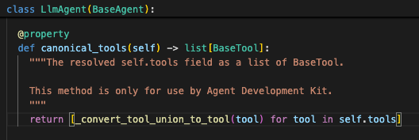
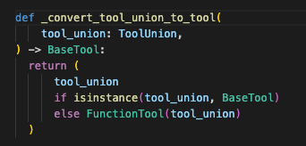
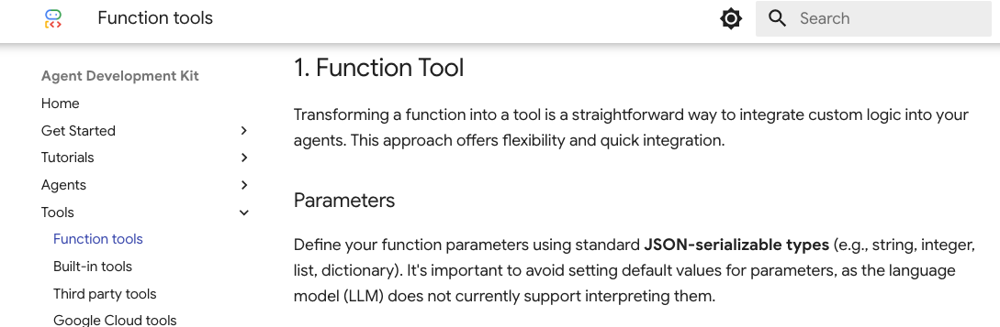
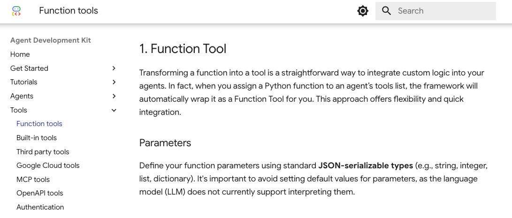
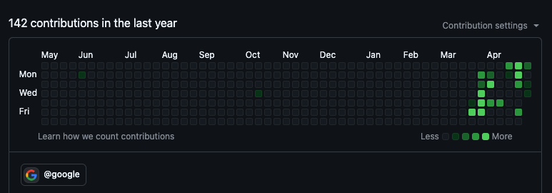

오늘은 소소한 자랑거리가 생겨서 포스팅을 하게 되었습니다. 제가 [google adk-docs](https://github.com/google/adk-docs)의 **contributor**가 되었습니다!! 오픈 소스 프로젝트에 contributor가 되는 경험은 처음이라 왠지 뿌듯하고 자랑하고 싶은 마음입니다.
최근 AI Agent기반의 개발을 진행하면서 google ADK(이하 ADK)를 사용하고 있습니다. ADK를 이용해 개발한 에이전트에 대한 내용은 추후 포스팅에서 차차 다루도록 하겠습니다.  ADK의 효율적이고 정확한 활용을 위해서 구글이 제공한 Docs를 기반으로 공부하며 개발을 진행하고 있는데, 아무래도 최근에 공개되어 그런지 설명이 미흡하거나(아니면 저의 이해가 부족하거나..) 아직 버그가 존재하는 경우가 있는 것 같습니다.
이전 포스팅에서 소개한 AI Agent에 대한 글을 보고 오셨다면, Agent를 유능하게 만들어주는 Tool에 대해서는 이미 알고 계실 것입니다. 이 Tool에 대한 내용을 보던 중 ADK에서 FunctionTool이라는 기능을 정의하고 있지만 Example Code에서는 FunctionTool을 전혀 사용하지 않는 것을 발견하였습니다. 해당 예시 코드는 아래와 같습니다.

```python
stock_price_agent = Agent(
    model='gemini-2.0-flash',
    name='stock_agent',
    instruction= 'You are an agent who retrieves stock prices. If a ticker symbol is provided, fetch the current price. If only a company name is given, first perform a Google search to find the correct ticker symbol before retrieving the stock price. If the provided ticker symbol is invalid or data cannot be retrieved, inform the user that the stock price could not be found.',
    description='This agent specializes in retrieving real-time stock prices. Given a stock ticker symbol (e.g., AAPL, GOOG, MSFT) or the stock name, use the tools and reliable data sources to provide the most up-to-date price.',
    tools=[get_stock_price],
)
```

FunctionTool이라는 Class가 코드에선 분명히 구현되어 있는데 왜 이 기능을 사용하지 않는 이유가 무엇인지, 사용하지 않아도 상관 없는 것인지 궁금해져서 코드를 뒤져보게 되었습니다.(여담이지만 저는 이렇게 코드를 뒤져보는게 수수께끼를 푸는 것 같고 재미있게 느껴질 때가 가끔 있습니다.)
google/adk/agents/llm_agent.py 에 정의된 LlmAgent 클래스 내부에서 tool에 관한 함수는 아래 이미지에 나온 것과 같이 canonical_tools함수 뿐이고, 해당 함수는 _convert_tool_union_to_tool라는 글로벌 함수를 호출하고 있었습니다.



> LlmAgent 클래스 일부

_convert_tool_union_to_tool" 함수를 찾아보니 아래 이미지처럼 tool을 받아서 FunctionTool로 자동으로 wrapping해주고 있는 형태로 되어있었습니다.



> _convert_tool_union_to_tool 함수

이를 통해서  Agent(Agent를 선언하면 자동으로 LlmAgent 클래스를 통해 선언되도록 alias 되어있음)에 tool을 선언하면 자동적으로 FunctionTool로 wrapping되는 것을 알게 되었습니다. 아마도 Custom Agent를 만들거나 다른 특수한 경우엔 FunctionTool을 사용해야 하는 경우가 있겠지만, 기본적으로는 FunctionTool을 사용해 함수를 직접 wrapping하는 경우는 많지 않을 것 같습니다. 문득 이런 내용을 docs에서 명확히 표현해주면 다른 사람들이 이해하기 쉽겠다는 생각이 들었습니다. 따라서 저는 해당 github에 issue를 열고 제 수정 제안 사항을 반영하여 PR을 하였습니다.

해당 내용이 궁금하신 분들은 아래 링크 확인하시면 됩니다.

[github issue 페이지](https://github.com/google/adk-docs/issues/210)

[github PR 페이지](https://github.com/google/adk-docs/pull/212)

그리고 몇일이 지났더니 해당 PR이 merge되어 제가 contributor 명단에 올라 갔습니다. 다음은 수정 반영 전/후의 docs 캡쳐입니다.



> Merge 되기 전 화면



> Merge 된 이후의 화면

사실 오픈소스에 contribution 한다는게 되게 코딩을 잘하는 고수의 영역이라고 생각했는데, 이런 간단한 제안/수정으로 contribution을 하게되어 어안이 벙벙한 면도 있습니다. 한편으로는 간단한 설명 추가이지만 이런 작은 조각들이 모여 많은 사람들이 편하게 사용할 수 있는 오픈소스 생태계가 이루어 진다는 점이 흥미롭게 느껴지기도 합니다. 무엇보다 저의 깃허브 프로필 contribution에 구글 태그가 귀엽게 붙어있으니 기분이 좋네요! 여러분들도 도전해보시길 바라며 오늘 포스팅은 여기까지 하겠습니다! 감사합니다.



> 부끄러운 잔디밭의 왼쪽 하단에서 구글 태그를 확인 할 수 있습니다.
