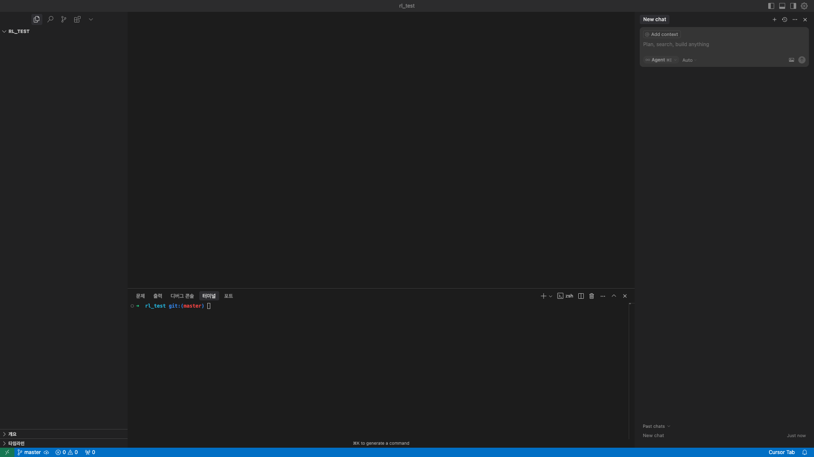
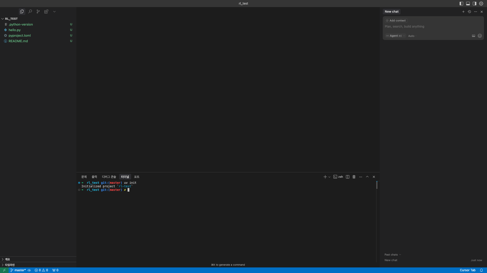
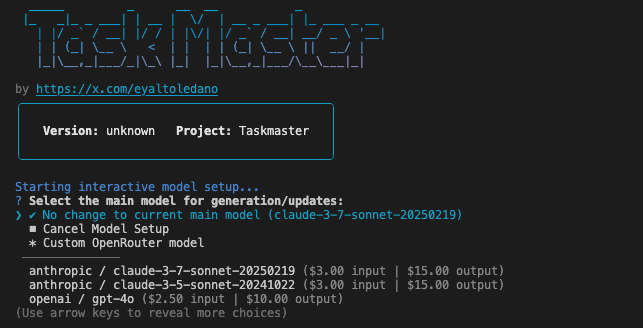
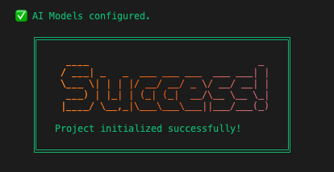
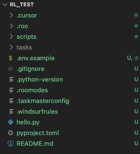
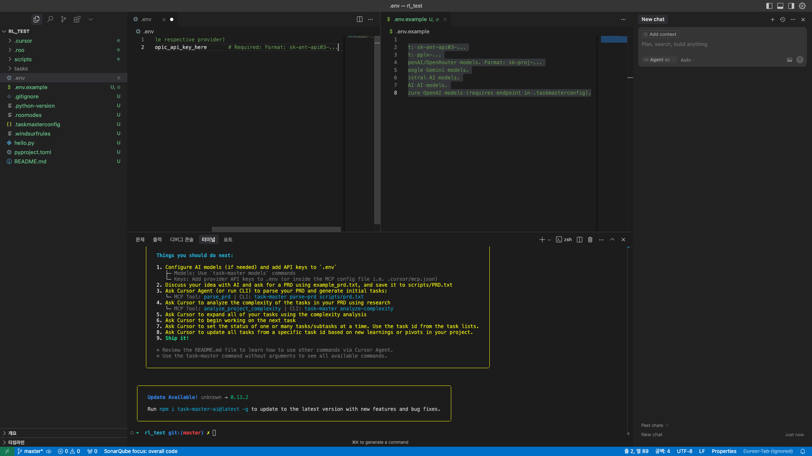

노마드 코더가 유투브에 공유해준 Task Master MCP를 실제로 사용해보았습니다. 이 MCP를 사용하는 방법을 정리하고 공유하고자 이 글을 작성합니다. 아래 링크의 영상을 참고하시면 이해에 도움이 될 것이라 생각됩니다.

[노마드코더 TaskMaster 유튜브 영상](https://www.youtube.com/watch?v=ktr-4JjDsU0)

## 설치
MCP의 설치는 아래 링크를 참조하여 진행하였습니다.

[claude-task-master github](https://github.com/eyaltoledano/claude-task-master)

저는 command line을 활용하여 전역적으로 설치하였습니다.

```bash
# Install globally
npm install -g task-master-ai

# OR install locally within your project
npm install task-master-ai
```

제대로 설치되었는지 확인하기 위해 터미널에서 실행시켜봅시다.

```bash
task-master
```

아래와 같은 화면이 표시된다면 제대로 설치된 것입니다.


## 세팅

이제 실제적인 활용을 위한 기본 세팅을 진행해보겠습니다.저는 사내에서 진행중인 강화학습 리서치 프로젝트에 Task Master MCP를 사용해보려고 합니다. 따라서, rl_test 프로젝트를 생성하고, 여기서 시작해보도록 하겠습니다. 저는 CursorAI(커서)를 사용하여 진행하였습니다. 아래는 새로 생성한 빈 프로젝트의 화면입니다.



먼저 uv를 통한 파이썬 패키지 활용을 위해 uv 초기화를 진행해 줍니다.

```bash
uv init
```

(uv가 설치되어 있다는 가정하에) 위 명령어를 실행하면 아래 이미지와 같이 README.md, pyproject.toml 등의 파일이 생성된 모습을 확인 할 수 있습니다.



이제 드디어 task master initialize를 진행할 차례입니다. 아래 명령어를 실행시켜 보겠습니다.

```bash
task-master init
```


위 이미지 하단의 터미널 부분을 보면, task-master를 alias 등록하여 tm 명령어로 사용할 수 있게 할건지 물어보는 화면이 표출됩니다. y를 눌러 수락하고 진행하였습니다.


뭔가가 출력되면서 초기화가 진행되고, 사용할 모델을 선택하는 단계로 진입합니다.(아래 이미지 참고)



생성 및 업데이트를 위한 default 모델은 claude-3-7-sonnet으로 지정되어 있으나 이 과정에서 고를 수 있는 것으로 보입니다. 이후에 알게된 사실이지만 초기 설정 이후에도 configuration 파일에서 간단히 변경할 수 있었습니다. 변경이 어렵지 않으니 부담없이 기본 설정으로 진행합니다. 엔터 몇번 탁탁 쳐주면 됩니다. 특정 모델을 선호하는 경우 키보드의 화살표 키를 사용하여 선택할 수 있습니다. 뭔가 많은것이 출력 될 것인데 아래와 같은 성공 화면이 나타나면 됩니다.



또한 아래 이미지처럼 새로운 파일들이 생성된 것을 확인할 수 있습니다.



새로 생성된 파일들 중 `.taskmasterconfig` file에서 앞서 세팅한 모델에 대한 내용을 확인할 수 있습니다. 또한 이 파일을 변경하여 task master가 사용할 모델을 변경할 수 있습니다.

이제 Task Master가 LLM 모델을 사용할 수 있도록 API Key를 등록해 줍니다. init을 실행하여 생성된 `.env.example` 파일을 참고하여 `.env` 파일을 생성하고, 해당 파일의 적절한 위치에 API Key를 입력해줍니다. 저는 Task Master가 기본 모델인 claude를 사용하도록 하였기 때문에 Anthropic API Key를 넣어주었습니다. 아래 이미지는 새로 생성한 `.env` 파일의 예시입니다. 화면의 우측에 열려있는 파일이 `.env.example` 파일이고, 저는 Anthropic API Key만 사용할 예정이기 때문에 해당 부분만 남겨 `.env` 파일을 생성하였습니다.



`.env` 파일을 생성하고 API Key까지 입력해 주었다면 기본적인 준비는 완료입니다. 다음 포스팅에서는 실제로 해당 MCP를 사용하며 기능을 살펴보겠습니다. 감사합니다.