이전 글에서 기본적인 Task Master MCP의 세팅을 완료하였습니다. 이제 본격적으로 프로젝트를 시작해 보겠습니다.

## 1. prd.txt 파일 생성

Task Master MCP는 prd.txt 파일을 기반으로 태스크를 생성하고 관리합니다. 저도 처음 사용해 보는지라 prd.txt가 어떻게 구성되야 할지 잘 몰라서 커서와의 채팅을 이용해 task-master의 핵심이 되는 prd 문서를 작성해 보았습니다. 아래 이미지처럼 채팅으로 대화를 시작하고, 이후 질문에 답하는 방식으로 AI에게 프로젝트에 대한 이해를 시켜줍니다. 이것 저것 질문이 끝나고 나면 커서의 에이전트가 prd.txt 파일을 생성합니다. 

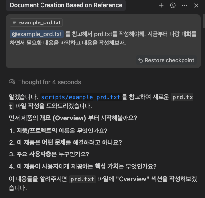

**주의!!** prd.txt 파일이 프로젝트 루트 경로의 scripts 디렉토리에 있어야 다음 단계가 원활이 진행됩니다.

여러 단계의 티키타카 대화를 통해 AI가 프로젝트에 대해 이해하고나면 prd.txt를 생성할 수 있습니다. 아래 화면에서 생성된 *scripts/prd.txt* 파일을 확인하실 수 있습니다.

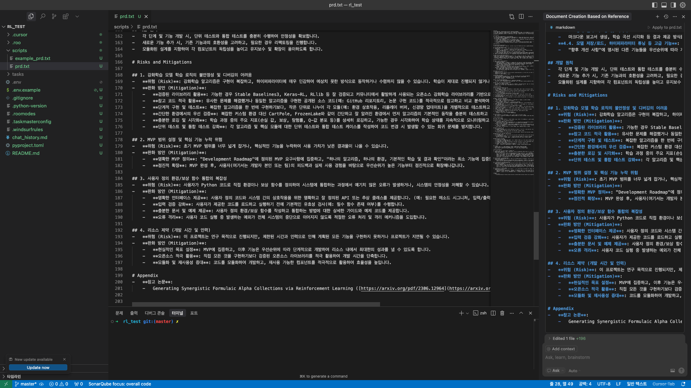

## 2. Task 생성

Task Master MCP는 prd.txt 파일의 내용을 토대로 하위 Task를 생성합니다. 채팅을 통해 요청하거나 터미널에서 다음의 명령어로 task 생성을 진행할 수 있습니다.

```bash
task-master parse-prd
```

저는 터미널에서 명령어를 실행하는 방법을 선택하였습니다. 터미널에서 위 명령어를 실행하시면 아래 화면처럼 **Parsing PRD and generating tasks...** 라는 문구가 출력되고 작업이 진행되는 것을 확인하실 수 있습니다.

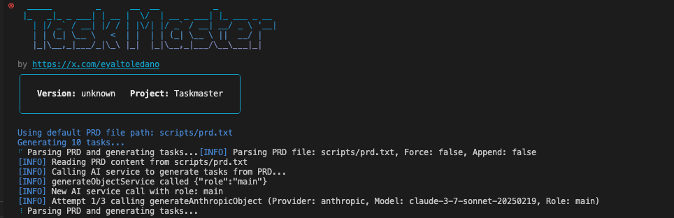

잠시 기다리시면 아래와 같은 task generation 성공 문구를 확인할 수 있습니다.

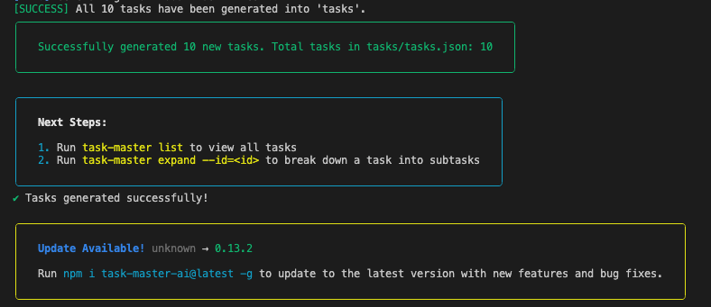

Task들이 어떻게 나누어져 생성 되었는지 아래의 명령어를 이용해 터미널에서 확인해보겠습니다. task-master list 명령어는 생성된 모든 task들을 보여주는 명령어입니다.

```bash
task-master list
```

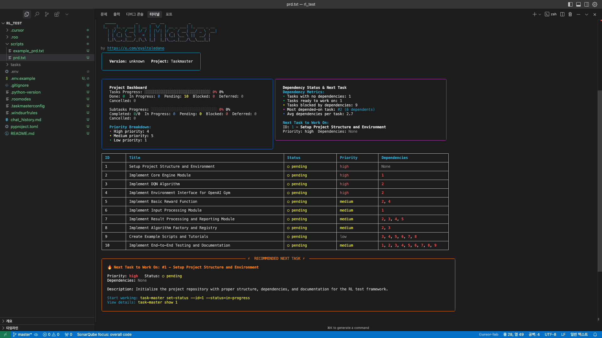

와... 생각보다 엄청 잘 구성되어 있는 것 같습니다. 프로젝트 진행도, 의존성, 중요도, 상태 등을 한눈에 파악할 수 있네요. 태스크도 나름 합리적으로 잘 쪼개어 진 것 같습니다.

## 3. Task 분석 

복잡한 Task를 더 작은 Task로 쪼개는 작업을 진행해 보겠습니다. 먼저 각 태스크의 난이도를 AI로 예측하기 위해 아래의 명령어를 실행합니다.

```bash
task-master analyze-complexity
```

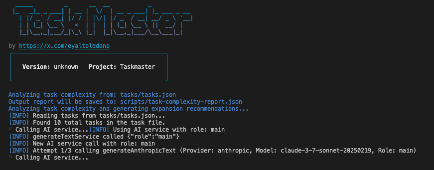

위와 같은 화면이 보이면서 AI 서비스를 실행해 분석을 진행합니다. 분석이 완료되면 아래와 같은 화면이 표시됩니다.

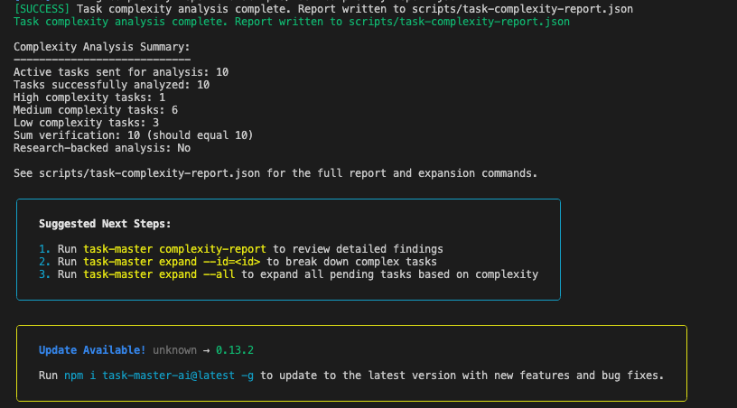

분석 결과를 확인하기 위해 아래의 명령어를 실행합니다.

```bash
task-master complexity-report
```

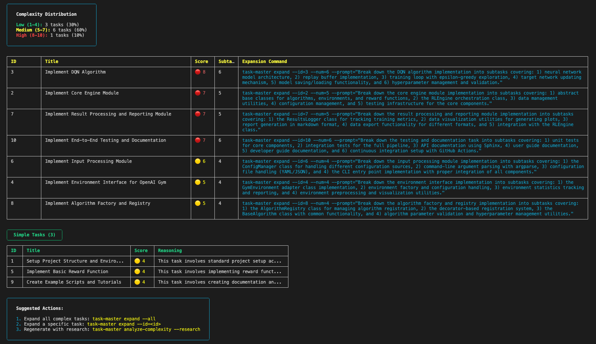

위 이미지처럼 태스크를 난이도 순으로 보고, 각 태스크에 추천되는 하위 태스크 수 또한 확인할 수 있습니다. 결과가 맘에 안들면 다음의 명령어로 리서치 모드를 사용하여 새 리포트를 만들 수 있다고 합니다.

```bash
task-master analyze-complexity --research
```

리서치 모드는 default로 *perplexity sonar-pro* 모델을 사용하도록 설정 되어 있습니다. 이를 사용하기 위해선 *PERPLEXITY_API_KEY*를 *.env*에 추가해야합니다. 또는 다음의 명령어를 사용해 research에 사용할 모델을 변경할 수 있습니다.

```bash
task-master models --setup
```

위 명령어를 실행하면 최초 task-master 초기화 할 때 모델을 설정했던 화면이 나오면서 각 단계에 사용할 모델을 설정할 수 있습니다. research에 사용 가능한 모델의 목록은 아래와 같습니다. 참고하셔서 *OPENAI_API_KEY*, *PERPLEXITY_API_KEY*, *XAI_API_KEY* 중 가지고 계신 API Key에 맞게 모델을 설정하시고 사용하시면 됩니다.

```bash
openai / gpt-4o-search-preview ($2.50 input | $10.00 output)
openai / gpt-4o-mini-search-preview ($0.15 input | $0.60 output)
perplexity / sonar-pro ($3.00 input | $15.00 output)
perplexity / sonar ($1.00 input | $1.00 output)
perplexity / deep-research ($2.00 input | $8.00 output)
xai / grok-3 ($3.00 input | $15.00 output)
xai / grok-3-fast ($5.00 input | $25.00 output)
```

저는 해당하는 API Key가 없으니 리서치 모드는 일단 패스하고 지나가도록 하겠습니다.

## 4. Sub Task 생성

위에서 생성한 보고서가 마음에 들었다면, 다음 단계로 하위 작업으로 펼치는 작업을 수행할 수 있습니다. 이때 모든 작업에 대해서 수행하고자 하는 경우 아래의 명령어를 실행합니다.

```bash
task-master expand --all
```

개별 작업을 하위 작업으로 펼치고자 할 경우 task ID를 활용합니다. task ID는 task-master list 또는 위에서 생성된 report에서 확인할 수 있습니다. (표에 ID 컬럼으로 나타납니다.) 개별 작업을 하위 작업으로 펼치는 명령어는 아래와 같습니다.

```bash
task-master expand --id=<id>
```

또는, complexity report의 *Expansion Command*컬럼에서 제안하는 expand 명령어를 사용할 수 있습니다. 이 전 단계에서 제가 생성한 보고서에서는 ID 3번 태스크에 대하여 다음과 같은 커맨드를 제안했습니다.

```bash
task-master expand --id=3 --num=6 --prompt="Break down the DQN algorithm implementation into subtasks covering: 1) neural network model architecture, 2) replay buffer implementation, 3) training loop with epsilon-greedy exploration, 4) target network updating mechanism, 5) model saving/loading functionality, and 6) hyperparameter management and validation."
```

위 명령어를 한 번 실행해보겠습니다. 아래 화면에서 *Expanding Task 3...* 문구와 *[SUCCESS]* 문구가 확인됩니다. *tasks/task_003.txt*파일에서 sub task가 제대로 생성되었는지 확인해보았습니다. 아래 이미지와 같이 제대로 생성 된 것을 확인할 수 있었습니다.

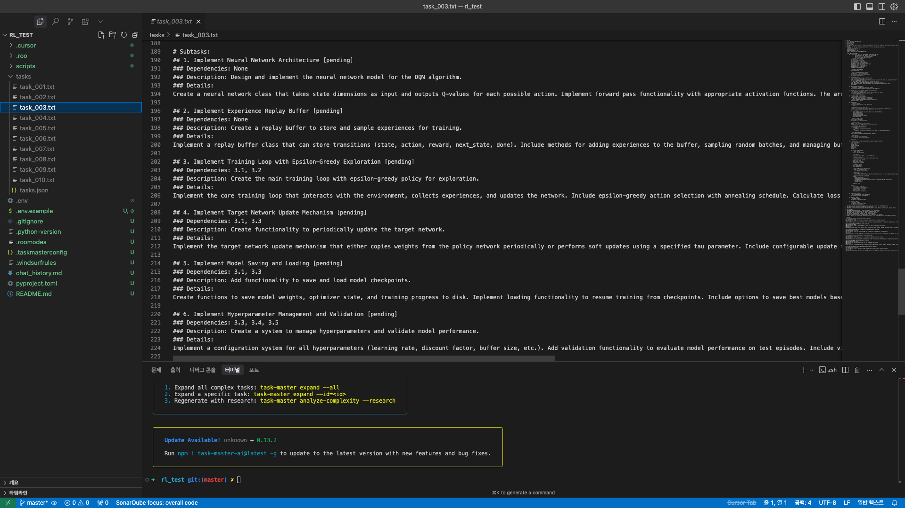

이번엔 위에서 *task-master expand --all* 명령어를 통해 전체 태스크에 대한 sub task 생성을 진행해보았습니다. 아래 이미지는 명령어 실행시 출력되는 내용의 일부입니다.

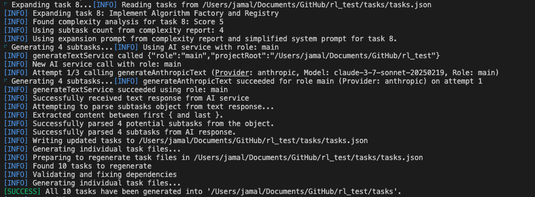

터미널에 출려되는 문구를 보니 *[INFO] Using subtask count from complexity report: 4*와 같이 complexity report의 내용을 활용하는 것을 확인할 수 있었습니다. 굳이 complexity report의 Expansion Command를 사용하지 않아도 자동으로 해당 커맨드를 적용해 주는 것으로 확인됩니다. 앞으로는 아래 두 명령어 중 취사 선택하여 사용하면 될 것 같습니다.

전체 태스크 확장:

```bash
task-master expand --all
```

개별 태스크 확장:

```bash
task-master expand --id=<id>
```

위 명령어를 통해 sub task 생성까지 완료하셨다면 이제 실제로 내가 다음으로 수행해야할 태스크가 무엇인지 확인해 보겠습니다. 터미널에 아래의 명령어를 실행 해보겠습니다.

```bash
task-master next
```

아래 이미지처럼 다음 태스크의 Implementation Detail과 Sub task를 확인할 수 있습니다.

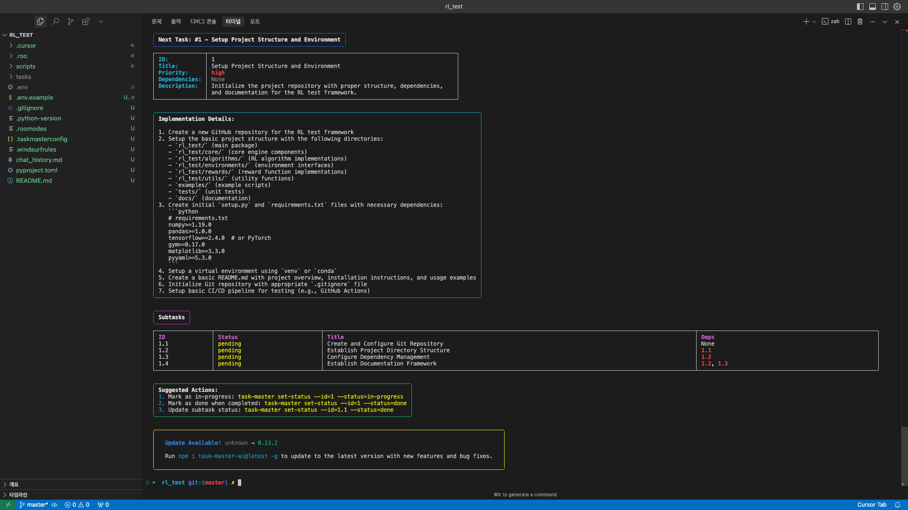

또는 아래의 명령어를 이용해 다른 태스크의 내용을 확인하실 수 있습니다.

```bash
task-master show <id>
```

예를 들어 *task-master show 3* 을 실행하면 태스크 ID 3의 내용을, *task-master show 3.1*을 실행하면 태스크 ID 3의 sub task 1의 내용을 확인하실 수 있습니다. 아래 이미지는 *task-master show 3.1*의 실행 결과입니다.

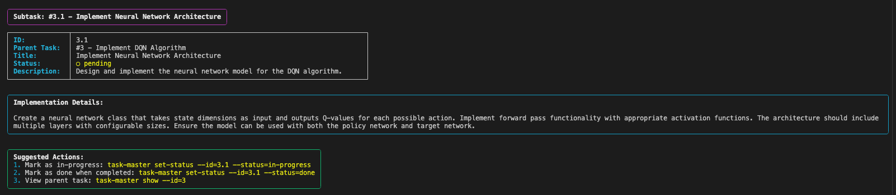

이제 여기서 표시되는 Implementation Details를 커서 AI에게 넘기면서 프로젝트 구현을 실행할 수 있을 것 같습니다.

## 5. 결론

LLM 기반의 AI 서비스는 context의 제약을 많이 받는 만큼 태스크를 잘게 쪼개고 작은 단위로 구현하며 프로젝트를 진행해 나가는 것이 유리한 전략인 것은 자명한 것 같습니다. 또한 이 글에서는 터미널에 명령어를 입력하는 것을 기반으로 설명을 드렸지만, 커서 AI 사용자라면 채팅을 통해 오늘 설명드린 일들을 모두 진행하실 수 있다는 점에서 매우 유용한 MCP라고 생각합니다. 다만 API 사용에 대한 비용이 늘어날 수 있다는 점이 걱정되기는 합니다.(제가 찾아본 정보로 미루어보아 태스크, 서브 태스크 및 리포트 생성 과정에서만 API를 호출하는 것으로 보입니다. 생각보다 API 비용이 많이 발생하지 않을 수 있을 것 같습니다.) 앞으로 Task Master MCP를 통해 프로젝트를 실제로 진행하면서 추가적인 사용 방법이나 사용 팁이 생기면 공유 드릴 수 있도록 하겠습니다. 감사합니다.

## 참고
[노마드코더 TaskMaster 유튜브 영상](https://www.youtube.com/watch?v=ktr-4JjDsU0)

[TaskMaster GitHub](https://github.com/eyaltoledano/claude-task-master)