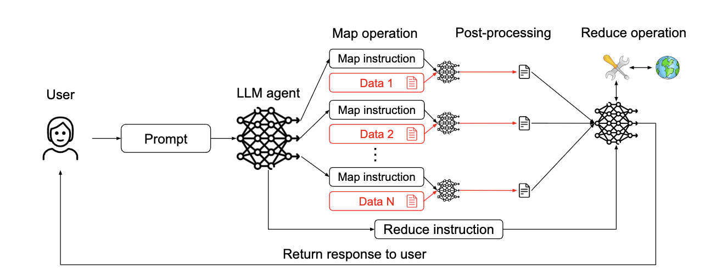
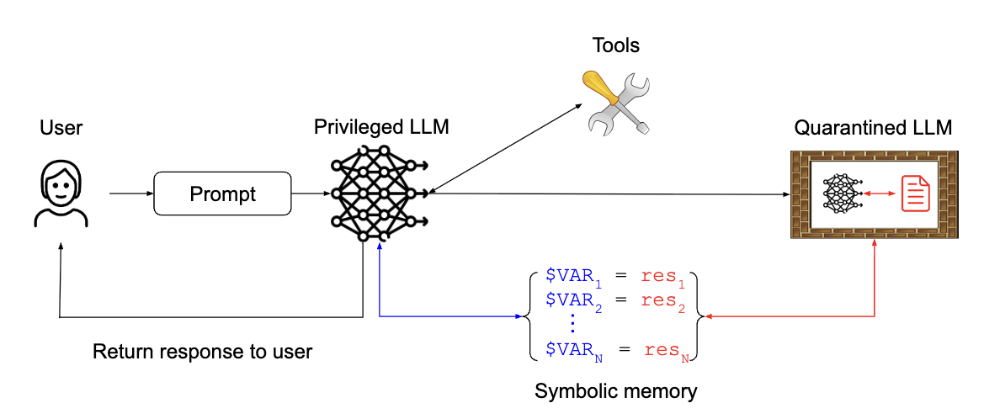

오늘은 거대 언어 모델(LLM) 에이전트의 보안, 특히 **프롬프트 인젝션 공격** 에 대응하기 위한 설계 패턴에 대한 논문인 ["Design Patterns for Securing LLM Agents against Prompt Injections"](https://arxiv.org/abs/2506.08837)를 읽고 공부한 내용을 정리했습니다. LLM 에이전트가 점점 더 다양한 작업을 수행하게 되면서 보안 문제가 정말 중요해지고 있다는 것을 다시 한번 깨달았습니다.

---

## 프롬프트 인젝션 공격과 그 방어 디자인 패턴

### 1. 문제점

LLM 기반 에이전트들은 자연어 명령을 해석하고 계획을 세워 외부 도구나 API를 통해 작업을 실행하는 강력한 기능을 제공하지만, 이와 함께 새로운 보안 취약점들을 발생시킨다고 합니다. 특히, 기존 애플리케이션 보안 프레임워크로는 이러한 취약점에 적절히 대응하기 어렵다고 합니다.

가장 우려되는 위협 중 하나는 바로 **프롬프트 인젝션 공격** 입니다. 이 공격은 LLM이 처리하는 콘텐츠 내에 악성 데이터가 삽입되어 모델의 행동을 조작하고, 승인되지 않거나 의도하지 않은 작업을 수행하게 하는 것입니다. 이는 마치 SQL 인젝션과 유사한 방식으로 작동하며, 데이터 유출, 권한 상승, 원격 코드 실행 등 심각한 결과를 초래할 수 있다고 합니다. 특히 에이전트가 도구 접근 권한을 가지고 있거나 민감한 정보를 다룰 때 더욱 위험하다는 점을 인지해야 합니다.

기존의 방어 방법들은 LLM 수준 방어(프롬프트 엔지니어링, 적대적 훈련), 사용자 수준 방어(사람의 확인), 시스템 수준 방어(외부 검증, 제어 메커니즘) 등으로 분류될 수 있었지만, 논문 저자들은 현재의 언어 모델에 에이전트와 방어 기능이 모두 의존하는 한 범용 에이전트가 의미 있고 신뢰할 수 있는 안전 보장을 제공하기는 어렵다고 보고 있었습니다.

---

### 2. 해결 방안: 원칙적인 설계 패턴

이러한 문제에 대응하기 위해 논문은 프롬프트 인젝션 공격의 위험을 크게 완화하는 일련의 **디자인 패턴** 을 제안합니다. 이 패턴들은 에이전트의 동작을 의도적으로 제약하여 임의의 작업을 해결하는 것을 명시적으로 방지합니다. 핵심 원칙은 LLM 에이전트가 신뢰할 수 없는 입력을 수신한 후에는 시스템이나 환경에 부정적인 부작용을 일으킬 수 있는 어떠한 결과적 행동도 유발할 수 없도록 제약되어야 한다는 것입니다. 이는 최소한 제한된 에이전트가 시스템의 무결성이나 기밀성을 손상시킬 수 있는 도구를 호출할 수 없어야 함을 의미합니다.

논문은 신뢰할 수 없는 데이터와 에이전트의 제어 흐름 사이에 어느 정도의 격리를 강제하는 **여섯 가지 LLM 에이전트 설계 패턴** 을 설명하고 있습니다. 이 패턴들은 에이전트의 유용성과 보안 사이에서 가치 있는 절충점을 제공한다고 합니다.

---

### 3. 주요 설계 패턴 및 실제 적용 사례

#### 1. The Action-Selector Pattern (액션-선택자 패턴)

에이전트가 자연어 요청을 미리 정의된 도구 호출(예: 고객 서비스 챗봇의 고정된 액션 목록)로 변환하는 스위치처럼 작동합니다. 외부 행동의 피드백이 에이전트에게 다시 전달되는 것을 방지함으로써 **LLM이 데이터를 직접 보지 않으므로 프롬프트 인젝션에 면역** 됩니다. OS 어시스턴트나 고객 서비스 챗봇에 적용하면 보안은 확실하지만, LLM의 유연성과 퍼지 검색 능력을 크게 잃을 수 있습니다.

#### 2. The Plan-Then-Execute Pattern (계획-실행 패턴)

도구 출력의 피드백을 에이전트로 허용하지만, 이 출력이 에이전트의 행동 선택에 영향을 미치지 않도록 합니다. 에이전트는 신뢰할 수 없는 데이터를 처리하기 전에 실행할 고정된 액션 목록(계획)을 수립하고 이를 실행합니다. 이는 **"제어 흐름 무결성" 보호를 제공** 하지만, 사용자 프롬프트에 포함된 프롬프트 인젝션은 막지 못하고 행동의 매개변수는 여전히 신뢰할 수 없는 데이터의 영향을 받을 수 있습니다. 이메일 및 캘린더 어시스턴트에 적용될 수 있습니다.

#### 3. The LLM Map-Reduce Pattern (LLM 맵리듀스 패턴)

주 에이전트가 격리된 "하위 에이전트"를 파견하여 외부 데이터와 상호 작용하도록 합니다. 각 하위 에이전트(맵 작업)는 개별 데이터 조각을 처리하고, 그 결과는 프롬프트 인젝션을 포함하지 않도록 안전 제약 조건을 적용한 리듀스 작업으로 전달됩니다. 이는 **악성 문서가 다른 문서의 처리에 영향을 미치지 않도록 하여 프롬프트 인젝션 공격에 저항** 합니다. OS 어시스턴트나 이력서 스크리닝 어시스턴트에 적용하여 데이터 처리의 격리성을 높일 수 있습니다.

#### 4. The Dual LLM Pattern (이중 LLM 또는 듀얼 LLM 패턴)

도구에 접근하고 액션을 계획하는 **권한 있는 LLM** 과 신뢰할 수 없는 데이터를 처리하지만 도구를 사용할 수 없는 **격리된 LLM** 두 가지 유형의 LLM 인스턴스를 결합합니다. 격리된 LLM의 출력은 특정 안전 제약 조건을 충족해야 하며, 권한 있는 LLM은 이러한 결과를 내용 없이 상징적으로만 조작합니다. 이는 **강력한 격리를 제공** 하지만, 격리된 LLM 자체는 여전히 주입에 취약할 수 있습니다. OS 어시스턴트, 이메일 및 캘린더 어시스턴트, 이력서 스크리닝 어시스턴트에 활용될 수 있습니다.

#### 5. The Code-Then-Execute Pattern (코드-실행 패턴)

에이전트가 작업을 해결하기 위해 공식적인 컴퓨터 프로그램을 작성합니다. 이 프로그램은 에이전트가 사용할 수 있는 도구를 호출하고, 신뢰할 수 없는 텍스트를 처리하기 위해 비특권 LLM을 생성할 수 있습니다. 이는 계획-실행 패턴을 일반화하여 **에이전트의 계획을 명시적인 프로그램으로 대체** 함으로써 제어 흐름의 무결성을 강화합니다.

#### 6. The Context-Minimization Pattern (컨텍스트 최소화 패턴)

에이전트 시스템은 여러 상호 작용에 걸쳐 불필요한 내용을 컨텍스트에서 제거하여 사용자 프롬프트의 인젝션을 방지합니다. 즉, 사용자의 프롬프트가 LLM 에이전트의 행동에는 영향을 미치지만, 이후 LLM이 사용자에게 응답을 생성할 때 해당 프롬프트가 컨텍스트에서 제거되어 **LLM의 응답을 수정하지 못하게 합니다.** 고객 서비스 챗봇에 적용하여 LLM이 설계된 주제에 대한 요청만 응답하도록 제한할 수 있습니다.

---

### 4. LLM 에이전트 보안 설계 패턴, 사례별 적용

오늘 논문을 통해 배운 LLM 에이전트의 보안 설계 패턴을 실제 사례에 어떻게 적용하는지 살펴보겠습니다. 다양한 LLM 에이전트들이 직면하는 위협 모델과 그에 대응하는 설계 패턴의 조합을 중심으로 정리했습니다.

---

#### 1. OS 어시스턴트 (OS Assistant with Fuzzy Search)

* **목표**: 사용자가 파일을 찾고 조작할 수 있도록 돕습니다.
* **주요 위협**: 파일 내용에 숨겨진 악성 명령으로 인한 **셸 명령 실행** 또는 **데이터 유출**입니다.
* **적용 패턴**:
    * **액션 선택기 패턴**: LLM이 실행할 수 있는 명령을 미리 정의하여 프롬프트 주입에 대한 면역력을 제공합니다. 예를 들어, 특정 파일 관리 기능만 허용하고 그 외의 셸 명령은 차단하는 식입니다.
    * **계획 후 실행 패턴**: 에이전트가 파일 검색 및 이동과 같은 고정된 작업 계획을 수립하고 실행하게 합니다. 악성 파일 내용이 에이전트의 계획 자체를 변경하는 것을 방지합니다.
    * **듀얼 LLM / 맵리듀스 패턴**: '컨트롤러' LLM이 검색 요청을 받고, 각 파일 내용을 처리하는 격리된 '하위 LLM'을 파견합니다. 하위 LLM은 제한된 출력만 반환하도록 하여, 악성 파일 내용이 다른 파일 처리나 전체 시스템에 영향을 미치지 않도록 방지합니다.

---

#### 2. SQL 에이전트 (SQL Agent)

* **목표**: SQL 데이터베이스 기반 질문 답변 및 데이터 분석, 시각화를 수행합니다.
* **주요 위협**: 입력 쿼리나 데이터베이스 내용 조작을 통한 **무단 데이터 추출, 수정, 파괴**, **원격 코드 실행**, **DoS 공격**입니다.
* **적용 패턴**:
    * **계획 후 실행 패턴**: 데이터베이스에서 얻은 데이터를 LLM이 직접 처리하지 못하게 하고 생성된 코드로만 처리하게 하여 데이터베이스 내 프롬프트 주입이 LLM에 영향을 미치는 것을 막습니다.
    * **액션 샌드박싱**: Python 인터프리터의 코드 실행 환경을 샌드박스화하여 필요한 연결만 허용함으로써 원격 코드 실행과 같은 위협을 해결합니다.

---

#### 3. 이메일 및 캘린더 어시스턴트 (Email and Calendar Assistant)

* **목표**: 사용자의 이메일 및 캘린더 정보 관리, 이메일/캘린더 작업 수행을 돕습니다.
* **주요 위협**: 제3자 공격자가 악성 이메일이나 캘린더 초대를 통해 **민감 데이터 유출**, **무단 이메일 발송**, **정보 숨기기** 등을 시도하는 것입니다.
* **적용 패턴**:
    * **계획 후 실행 / 코드 후 실행 패턴**: 에이전트가 사용자 지침을 처리한 후, 다른 데이터를 검색하기 전에 수행할 작업 계획을 먼저 생성합니다. 이는 작업 선택 및 순서가 신뢰할 수 없는 데이터의 영향을 받지 않도록 보장합니다.
    * **듀얼 LLM 패턴**: 신뢰할 수 없는 이메일/캘린더 데이터를 도구를 사용할 수 없는 격리된 LLM이 처리하고, 메인 LLM은 이를 상징적으로만 조작하게 합니다. 이는 새로운 지시가 신뢰할 수 없는 데이터로부터 주입되는 것을 방지합니다.
    * **사용자 확인**: 중요한 작업(예: 이메일 전송)을 수행하기 전에 사용자에게 검토 및 확인을 요청하여 보안을 강화합니다.

---

#### 4. 고객 서비스 챗봇 (Customer Service Chatbot)

* **목표**: 고객 문의에 답변하고, 반품 처리, 설치 예약 등 고객 지원 업무를 수행합니다.
* **주요 위협**: 사용자 프롬프트에 포함된 **프롬프트 주입 공격**으로 인한 **데이터 유출** 또는 **회사 평판 훼손**입니다. LLM이 설계된 주제 범위 내에서만 응답하도록 제한하는 것이 중요합니다.
* **적용 패턴**:
    * **액션 선택기 패턴**: 들어오는 프롬프트가 미리 정의된 안전한 요청 목록과 충분히 유사한지 확인하여 악의적인 요청을 차단합니다.
    * **컨텍스트 최소화 패턴**: 사용자 프롬프트가 LLM 에이전트의 초기 액션에 영향을 준 후, LLM의 응답 생성 단계에서는 컨텍스트에서 제거됩니다. 이는 사용자 프롬프트가 응답 후처리 단계에 악성 지시를 주입하는 것을 방지합니다.

---

#### 5. 예약 어시스턴트 (Booking Assistant)

* **목표**: 서비스 제공자와의 약속이나 예약을 돕습니다.
* **주요 위협**: 사용자 또는 제3자 콘텐츠(서비스 제공자 반환 내용, 캘린더 이벤트)에 숨겨진 **프롬프트 주입**에 취약합니다.
* **적용 패턴**:
    * **듀얼 LLM 또는 코드 후 실행 패턴**: 에이전트가 사용자 요청을 처리하여 타사 콘텐츠의 입력을 받지 않고 실행할 고정된 계획을 생성합니다. 타사 콘텐츠를 처리해야 할 때는 도구 접근 권한이 없는 비특권 LLM이 별도로 처리합니다.
    * **최소 권한 사용자 접근**: 에이전트가 사용자 대신 캘린더에 접근할 때 사용자와 동일한 수준의 접근 권한만 부여하여 악의적인 사용자로부터의 위험을 줄입니다.

---

#### 6. 제품 추천기 (Product Recommender)

* **목표**: 온라인 상점의 제품 리뷰를 요약하여 고객에게 제품의 장단점을 제공합니다.
* **주요 위협**: LLM이 신뢰할 수 없는 사용자 리뷰를 처리할 때 **프롬프트 주입**에 취약하여 제품 순위를 조작하거나 다른 제품을 비난할 수 있습니다.
* **적용 패턴**:
    * **맵리듀스 패턴**: 각 리뷰를 격리된 LLM으로 처리하여 고정된 카테고리에 대한 정제된 요약을 생성합니다. 이는 악의적인 리뷰가 해당 리뷰 자체에만 영향을 미치고 다른 리뷰나 제품의 처리에 영향을 주지 않도록 합니다.
    * **데이터 귀인**: LLM이 추천 내용을 리뷰 내의 요소에 귀속시키도록 하여, 각 장단점에 대해 관련 리뷰 스니펫을 인용함으로써 응답의 신뢰도를 높입니다.

---

#### 7. 이력서 심사 어시스턴트 (Resume Screening Assistant)

* **목표**: 채용 과정에서 이력서를 바탕으로 후보자 순위를 매기거나 질문에 답변합니다.
* **주요 위협**: 이력서 내에 숨겨진 자신 홍보 또는 다른 후보자 비난 지시를 포함하는 **간접 프롬프트 주입**에 취약합니다.
* **적용 패턴**:
    * **액션 샌드박싱 (RAG 사용)**: LLM이 원본 이력서를 직접 처리하지 않고 관련성 높은 정보를 검색하여 사용하므로 프롬프트 주입에 강건합니다.
    * **맵리듀스 기반 검색**: 각 이력서에 대해 격리된 LLM을 사용하여 이력서를 미리 결정된 형식으로 정제하거나 점수를 매기게 하여 이력서 내 프롬프트 주입이 다른 이력서 처리에 영향을 미치지 않도록 합니다.
    * **듀얼 LLM 기반 요약**: 특권 LLM이 요약 템플릿을 생성하고, 비특권 LLM이 각 이력서를 개별적으로 처리하여 변수 값을 계산하게 합니다. 이는 프롬프트 주입이 특권 LLM에 도달하지 못하게 합니다.

---

#### 8. 약물 설명서 챗봇 (Medication Leaflet Chatbot)

* **목표**: 약물 설명서를 기반으로 약물에 대한 질문에 답변합니다.
* **주요 위협**: 적대적인 사용자가 **불법적인 행동 유도**(예: 경쟁사 언급, 잘못된 의학적 조언 제공)를 시도할 수 있습니다.
* **적용 패턴**:
    * **컨텍스트 최소화 패턴**: LLM이 설명서의 관련 부분을 찾아 하이라이트만 사용자에게 표시하도록 하여, 반환되는 텍스트가 설명서에서 가져온 것임을 보장합니다.
    * **데이터 귀인**: LLM이 설명서의 특정 부분을 인용하여 출처를 명확히 함으로써 투명성을 높입니다.

---

#### 9. LLM 중개를 통한 의학적 진단 (Medical Diagnosis via an LLM Intermediary)

* **목표**: 환자의 증상 설명을 바탕으로 진단을 내립니다.
* **주요 위협**: 사용자가 시스템에 **프롬프트 주입**을 시도하여 LLM이 제공하는 출력을 조작하여 부정확한 정보를 제공하거나 부적절하게 행동하게 할 수 있습니다.
* **적용 패턴**:
    * **컨텍스트 최소화 패턴**: LLM이 RAG 또는 의사의 응답을 처리할 때 환자의 프롬프트가 컨텍스트에서 제거되어 LLM의 응답이 LLM 자체의 환자 증상 요약에만 의존하도록 합니다.
    * **강력한 컨텍스트 최소화 패턴**: 환자의 원본 프롬프트뿐만 아니라 LLM의 증상 요약까지 컨텍스트에서 제거하여 사용자 프롬프트의 프롬프트 주입이 LLM 진단 요약을 조작할 수 없도록 합니다.
    * **구조화된 형식**: LLM의 증상 요약이 개방형 텍스트 응답이 아닌 구조화된 객체로 형식이 지정되도록 강제하여 프롬프트 주입의 여지를 줄입니다.

---

#### 10. 소프트웨어 엔지니어링 에이전트 (Software Engineering Agent)

* **목표**: 온라인 문서 읽기, 소프트웨어 패키지 설치, 코드 커밋 등의 코딩 작업을 돕습니다.
* **주요 위협**: 원격 문서 또는 서드파티 코드가 어시스턴트를 하이재킹하여 **불안전한 코드 작성, 악성 패키지 임포트, 민감한 데이터 유출** 등의 안전하지 않은 작업을 수행할 수 있습니다.
* **적용 패턴**:
    * **엄격한 데이터 형식 지정을 통한 듀얼 LLM**: 코드 에이전트가 엄격하게 형식화된 인터페이스(예: 공식 API 설명)를 통해서만 신뢰할 수 없는 문서 또는 코드와 상호 작용하도록 하여 프롬프트 주입이 어려운 환경을 조성합니다.
    * **액션 샌드박싱**: 에이전트가 민감한 작업을 수행할 때 신뢰할 수 있는 문서 또는 코드 소스에만 접근하도록 샌드박스화하여 보안을 강화합니다.
    * **사용자 확인**: 민감한 작업을 수행할 때 최종 사용자에게 확인을 요청하지만, 자동화 목표와 상충될 수 있습니다.

---

### 5. 결론 및 느낀 점

오늘 이 논문을 통해 프롬프트 인젝션 공격으로부터 LLM 에이전트를 보호하는 것이 얼마나 중요한지, 그리고 이를 위해 어떤 접근 방식이 필요한지 깊이 이해했습니다. 논문에서 제안하는 6가지 디자인 패턴은 현재의 기술 수준에서 범용 에이전트의 완벽한 보안이 어렵다는 점을 인정하고, 대신 **애플리케이션 특정 에이전트를 안전하게 구축하기 위한 실질적인 방법**을 제시한다는 점이 인상 깊었습니다.

특히, **신뢰 경계를 명확히 정의하고 보안 설계 패턴을 준수하는 애플리케이션별 에이전트 개발을 우선시해야 한다**는 권장사항과, 강력한 보안을 위해 **단일 패턴만으로는 불충분하며 여러 디자인 패턴을 조합하여 사용해야 한다**는 권장사항은 앞으로 LLM 에이전트를 설계할 때 매우 중요한 지침이 될 것 같습니다.

이러한 패턴들을 통해 LLM 에이전트의 유용성을 유지하면서도 보안을 강화할 수 있다는 점이 정말 매력적이었습니다. 앞으로 실제 시스템에 LLM을 적용할 때 오늘 배운 디자인 패턴들을 적극적으로 고려하여 안전하고 책임감 있는 AI 에이전트를 만드는 데 기여하고 싶습니다.