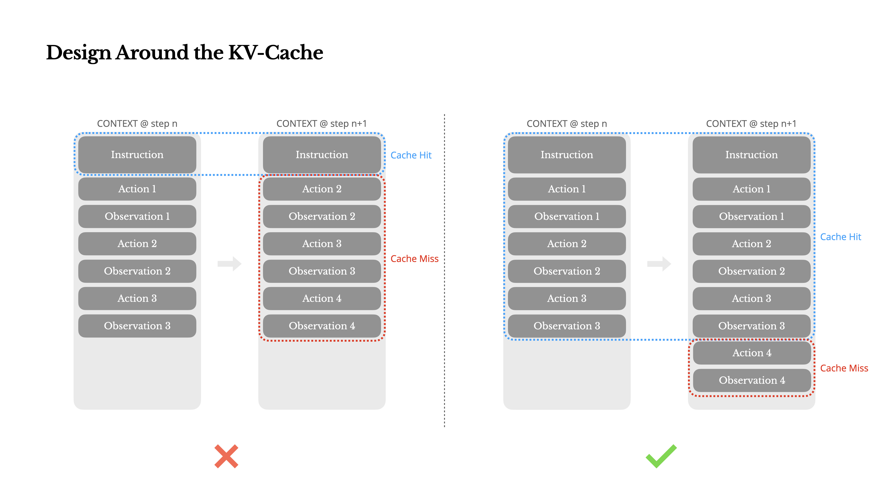
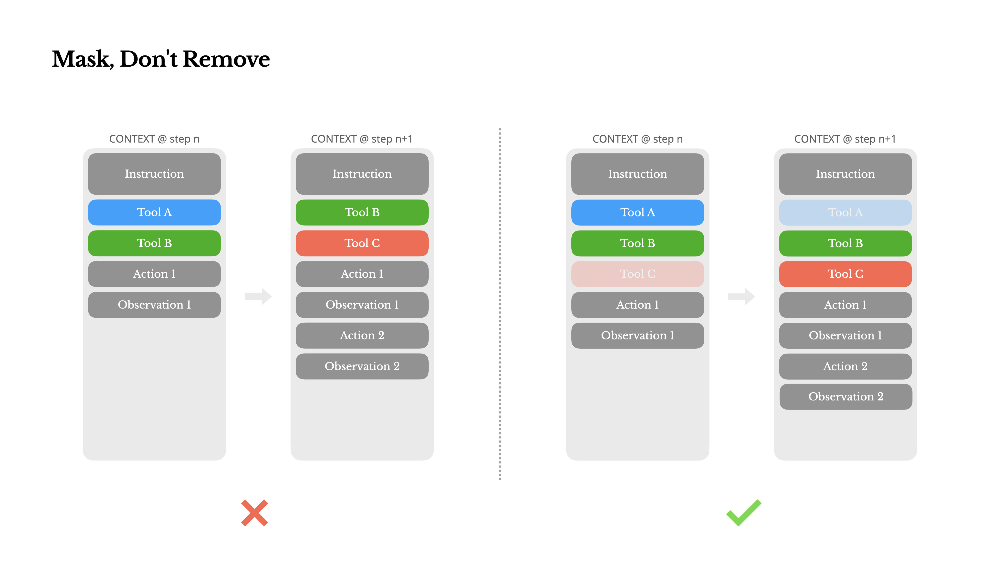
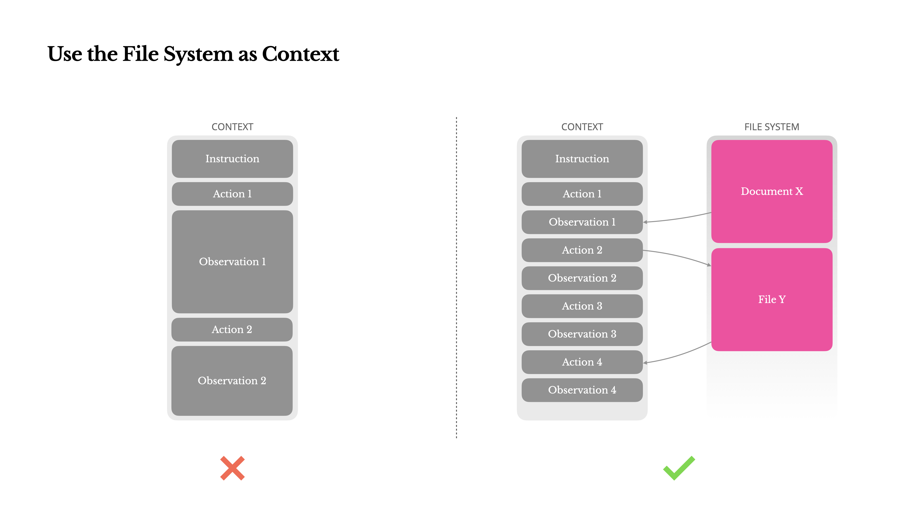
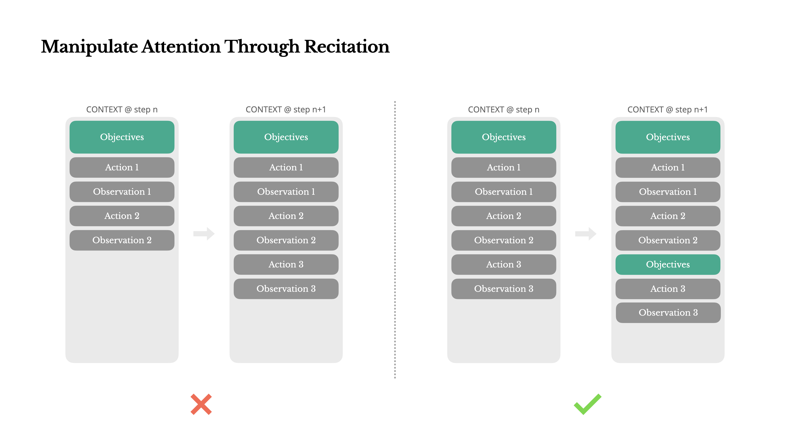
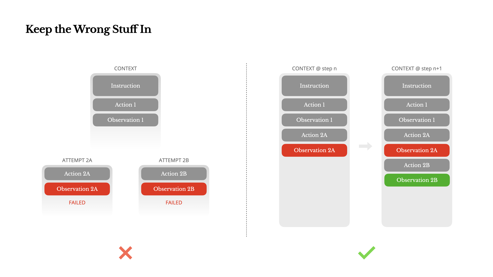
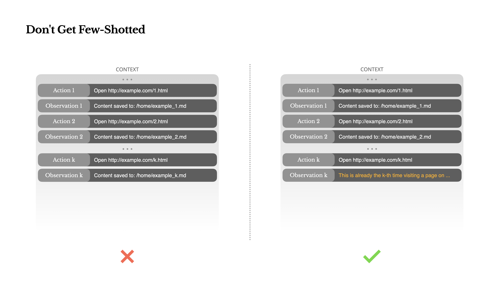

저는 지금까지 AI 에이전트 및 Multi-Agent System에 대해 Observability, Design Patterns, Protocol 등을 다양한 측면에서 공부하며 적용해 왔습니다. 그런데 오늘 Manus에서 공개한 ["Context Engineering for AI Agents: Lessons from Building Manus"](https://manus.im/blog/Context-Engineering-for-AI-Agents-Lessons-from-Building-Manus) 글을 읽게 되었고, 이 글을 통해 AI 에이전트의 성능과 안정성 향상을 위한 **컨텍스트 엔지니어링** 측면에서의 구체적인 전략을 알게 되어 깊은 통찰을 얻었습니다. 이 글은 기존에 학습했던 다양한 AI 에이전트 관련 개념들을 실제 프로덕션 환경에 적용하는 실용적인 방법을 제시했습니다. 오늘은 이글에서 제시한 다양한 기법들을 간략하게 정리해보았습니다.

---

## KV-캐시 활용 최적화

KV-캐시 활용 최적화의 중요성에 대한 내용은 새로운 정보였습니다. **LLM 기반 에이전트의 성능에서 KV-캐시 적중률이 지연 시간과 비용에 직접적인 영향을 미치는 가장 중요한 단일 지표**라는 점은 예상보다 깊은 최적화 영역이었습니다. 시스템 프롬프트 시작 부분에 초 단위 타임스탬프를 포함하는 작은 실수가 캐시를 무효화하여 10배에 달하는 비용 차이를 유발할 수 있다는 설명은 중요하게 다가왔습니다.

프롬프트를 안정적으로 유지하고, 컨텍스트를 추가 전용(append-only)으로 만들며, 필요할 때 캐시 브레이크포인트를 명시적으로 지정하는 것이 중요합니다. 이는 단순히 LLM의 비용이나 지연 시간을 줄이는 것을 넘어, 에이전트 시스템 전체의 효율성을 좌우하는 핵심 요소입니다.

사실 KV-캐시는 저에게 생소한 개념입니다. 추후 KV-캐시에 대한 심도있는 스터디를 진행해 봐야겠습니다.

---

## 도구 관리: 마스킹 원칙

에이전트의 행동 공간, 즉 도구(Tool)를 관리하는 방식에 대한 접근도 흥미로웠습니다. 기존에는 필요에 따라 도구를 동적으로 추가하거나 제거하는 것을 고려했으나, Manus 팀은 **"제거하지 말고 마스킹하라(Mask, Don't Remove)"** 는 원칙을 제시했습니다. 이 원칙은 도구를 동적으로 추가하거나 제거할 경우 KV-캐시가 무효화되거나 모델이 이전 동작을 참조하며 혼란을 겪는 문제를 방지합니다. 대신, 컨텍스트를 인지하는 상태 머신을 사용하여 디코딩 과정에서 특정 액션의 토큰 로짓(logits)을 마스킹하여 도구 가용성을 제어하는 방식이 더욱 안정적이고 효율적입니다.

---

## 파일 시스템을 통한 컨텍스트 활용

파일 시스템을 궁극적인 컨텍스트로 활용하는 접근 방식은 매우 혁신적이었습니다. LLM의 컨텍스트 창이 아무리 커져도 실제 에이전트 시나리오에서는 충분하지 않거나 오히려 비용이나 성능 저하로 이어질 수 있다는 문제 제기에 공감했습니다. Manus는 이 문제를 해결하기 위해 파일 시스템을 무제한 크기, 영구적인 특성, 에이전트가 직접 조작 가능한 **"궁극적인 컨텍스트"**로 취급합니다. 웹 페이지 내용을 URL만 남기고 컨텍스트에서 제거하거나, 문서 내용을 경로만 남기고 생략하는 등 정보 손실 없이 컨텍스트 길이를 줄이는 **'복원 가능한 압축'** 전략은 에이전트의 장기적인 상호작용과 방대한 데이터 처리에 필수적인 아이디어입니다.

---

## 낭송을 통한 주의 조작

긴 작업에서 에이전트의 집중력을 유지하는 방법, 즉 **"낭송을 통한 주의 조작(Manipulate Attention Through Recitation)"** 기법도 매우 실용적이었습니다. 에이전트가 `todo.md` 파일을 생성하고 작업이 진행됨에 따라 이를 업데이트하면서 자신의 목표를 컨텍스트의 끝 부분에 지속적으로 재작성하는 방식입니다. 이는 LLM이 긴 컨텍스트에서 초기 목표를 잊어버리거나 다른 주제로 벗어나는 "lost-in-the-middle" 문제를 해결하고, 에이전트의 초점을 작업 목표로 유지하는 데 효과적입니다.

경험적으로도 Cursor AI와 같은 AI code assistant와 협업 할 때에도 `plan.md` 를 context로 제공하고, 이를 계속 참조하면서 진행 했을 때 더 좋은 성과를 확인할 수 있었습니다. 저는 주로 api 호출을 통해 에이전트를 구성하고 활용하는데, 에이전트 시스템을 서비스 할 때 이와 비슷한 효과를 낼 수 있는 방법을 고민 해봐야겠습니다.

---

## 오류 처리: 잘못된 것을 그대로 두기

**"잘못된 것을 그대로 두라(Keep the Wrong Stuff In)"** 는 원칙 또한 인상 깊었습니다. 일반적으로 오류가 발생하면 트레이스를 정리하거나 재시도하는 방식으로 숨기려 하지만, Manus 팀은 실패한 액션과 그 결과(오류 메시지 등)를 컨텍스트에 그대로 두는 것이 에이전트 행동 개선에 가장 효과적인 방법 중 하나라고 강조했습니다. 모델이 실패를 직접 보고 내부 신념을 업데이트함으로써 같은 실수를 반복할 가능성을 줄일 수 있습니다. 오류 복구(error recovery)가 진정한 에이전트 행동의 가장 명확한 지표 중 하나라는 점은 에이전트의 **자기 성찰** 능력과 관련이 있습니다.

이 내용은 Self-reflection과 그 궤를 같이하는 내용이라고 생각됩니다. 또한 전에 소개드렸던 에이전트의 '메타인지' 방법에서도 **자기 성찰** 은 중요한 요소 중 하나였습니다. 이전에 공부했던 내용이 나오니 반갑기도 합니다.

---

## 퓨샷 함정 회피

마지막으로 **"퓨샷 함정에 빠지지 마라(Don't Get Few-Shotted)"** 는 경고도 중요했습니다. 퓨샷 프롬프팅이 LLM 성능 개선에 유용하지만, 에이전트 시스템에서는 컨텍스트 내 유사한 과거 행동-관찰 쌍이 많을수록 모델이 최적이 아닌 패턴을 반복하려는 경향이 있어 오히려 역효과를 낼 수 있다는 점입니다. 이를 해결하기 위해 액션과 관찰에 의도적인 구조적 다양성을 도입하여 패턴을 깨고 모델의 주의를 조정해야 합니다. 이는 에이전트의 **적응성**을 높이는 실질적인 방법입니다.

개인적으로 퓨샷 러닝은 상당히 유용한 방법이고 프롬프트에 자주 활용해 왔습니다. 아직 글에서 소개하는 퓨샷 러닝의 역효과를 경험해 본 적은 없지만, 잘 기억해 두었다가 비슷한 상황을 마주치면 활용해 볼 수 있을 것 같습니다.

---

## 결론

Manus 글을 통해 AI 에이전트 개발은 단순히 뛰어난 LLM을 사용하는 것을 넘어, **"컨텍스트"** 라는 기본적인 요소를 어떻게 정교하게 설계하고 조작하느냐에 따라 성능, 비용, 안정성, 학습 능력이 크게 달라질 수 있다는 점을 절실히 깨달았습니다. 앞으로 에이전트 프로젝트를 진행할 때 이 모든 원칙들을 염두에 두고, **컨텍스트 엔지니어링**을 중요하게 고려해야 할 것입니다.