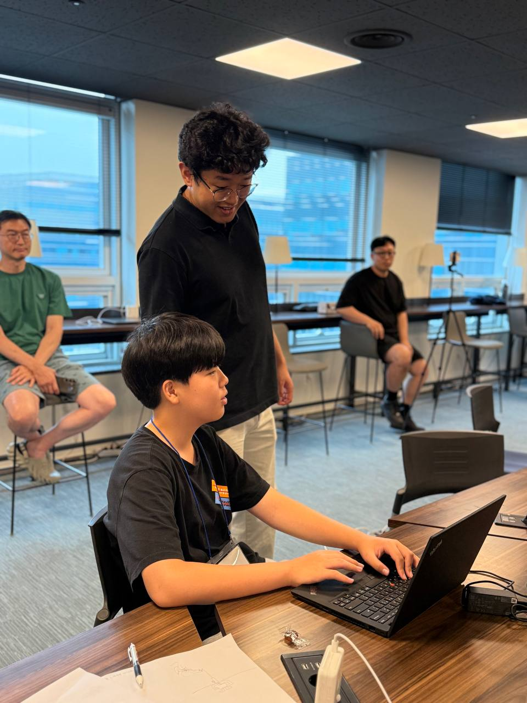
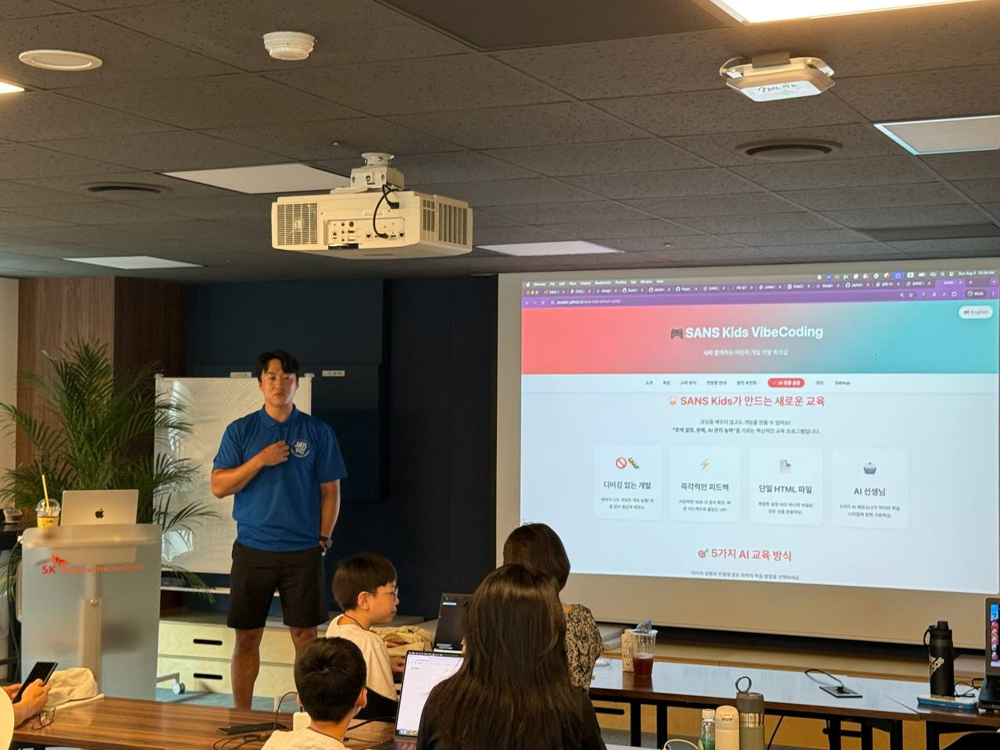
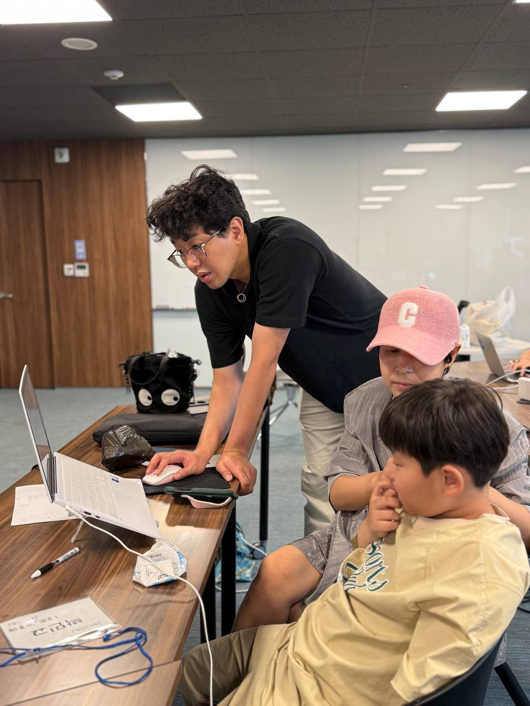

## 아이들을 위한 VibeCoding Workshop을 마치고

이번 주말은 저에게 특별하고 보람 있는 시간이었습니다. **SANS Kids VibeCoding Workshop** 을 통해 아이들과 웹 게임을 만들며 의미있는 시간을 보냈습니다. 8세부터 16세까지 다양한 연령대의 아이들과 함께하며 저 또한 많은 것을 배웠습니다.

> 아이의 작업물 구경..

이번 자원봉사의 목표는 아이들이 AI를 강력한 도구로 활용해 창의적인 문제 해결 능력을 기르고, 미래에 AI와 동료처럼 협업하는 방법을 배우는 것이었습니다. 저는 아이들의 첫 웹 게임 개발을 안내하며 시간을 보냈습니다. 특히 강의를 이끌어주신 재원님의 레슨 플랜은 **"질문이 전부다"** 라는 철학을 바탕으로 아이들이 날카로운 질문이 더 깊은 답을 이끌어낸다는 것을 이해하도록 이끌었습니다. 아이들은 하나의 아이디어를 한 AI 에이전트에 질문하고, 다른 에이전트가 이를 비평하게 한 뒤, 세 번째 에이전트와 함께 정제하는 **Multi-AI Persona 워크플로우를 연습**했습니다. 단순히 문법을 가르치는 대신, 문제를 정의하고 AI 어시스턴트에게 설명하며 게임이 만족스러워질 때까지 반복하는 과정을 통해 **AI를 창의적인 팀원으로 대하는 법을 익히도록** 했습니다.

> 강의중인 재원님

특히 **"SANS Kids VibeCoding"** 은 Cursor AI의 도움을 받아 단 4~5시간 만에 커리큘럼, 데모 페이지, 샘플 게임 루프까지 완성하는 웹 브라우저 전용 게임 개발 워크숍이었습니다. 이번 Workshop을 위해 Claude Code를 통해 만들어진 샌드 박스는 오류가 발생해도 계속 진행되어 끊임없는 실험이 가능하도록 설계된 점이 특징입니다.

* [Live Demo & Write-up](https://jayleekr.github.io/sans-kids-school-2025/index-en.html)
* [Source & Meterials](https://github.com/jayleekr/sans-kids-school-2025)

이번 워크숍을 통해 많은 것을 보고 느꼈습니다. 무언가를 아는 것과 어린아이들에게 설명하는 것은 완전히 다른 일이었고, 이 과정을 통해 저 스스로도 배움이 있었습니다. 아이들이 AI 에이전트와 기존의 틀을 깨고 얼마나 유연하고 자유롭게 상호작용하고 활용하는지에 깊은 인상을 받았습니다. 심지어 어떤 아이들은 AI 도우미에게 프로젝트를 넘길 때, 이전에 함께했던 AI에게 정이 들어 항의하는 모습까지 보였습니다. AI를 거의 한 명의 개인처럼 여기고 유대감을 형성하는 모습은 놀라웠습니다.

> 수업에 집중하는 모습

아이들이 보여준 모습은 호기심과 협업이 단발성 프롬프트보다 중요하다는 것을 보여주었습니다. 저는 앞으로 AI와 동료로서 얼마나 효과적으로 협력하는지가 핵심 역량이 될 것이라고 생각합니다. 이번 세션에 참여한 아이들과 그들의 부모님들이 이 핵심 개념을 이해했을 것이라고 확신합니다.

> 오류 해결중인 나...

"SANS Kids VibeCoding"에 참여한 것은 영감을 주는 경험이었습니다. 이 프로젝트는 지식 공유와 다음 세대에 힘을 실어주는 정신을 보여주었습니다. 재원님과의 협업 또한 저에게 학습 경험을 안겨주었습니다. 어린 친구들이 AI를 강력한 도구로 이해하고 적극적으로 활용하는 데 도움을 줄 수 있었다는 점이 보람 있었고, 이는 그들에게 미래에 필요한 기술을 갖추게 하는 중요한 단계라고 생각합니다.

> 수료증 받을 준비중인 아이들

저에게도 아이들에게도 매우 유익하고 즐거운 주말이었습니다. 앞으로도 이런 기회가 더 많아지기를 바랍니다. 재원님께 이렇게 좋은 기회를 만들어주신 것에 대해 감사드립니다. 지웅님과 경준님도 훌륭한 협력자로서 함께 해주셔서 감사드립니다.

* [재원님 LinkedIn](https://www.linkedin.com/in/jayjayleekr/)
* [지웅님 LinkedIn](https://www.linkedin.com/in/jiwoong-kim-b9934417a/)
* [경준님 LinkedIn](https://www.linkedin.com/in/koungjun-min-496499329/)

> Workshop 전날 준비 회의